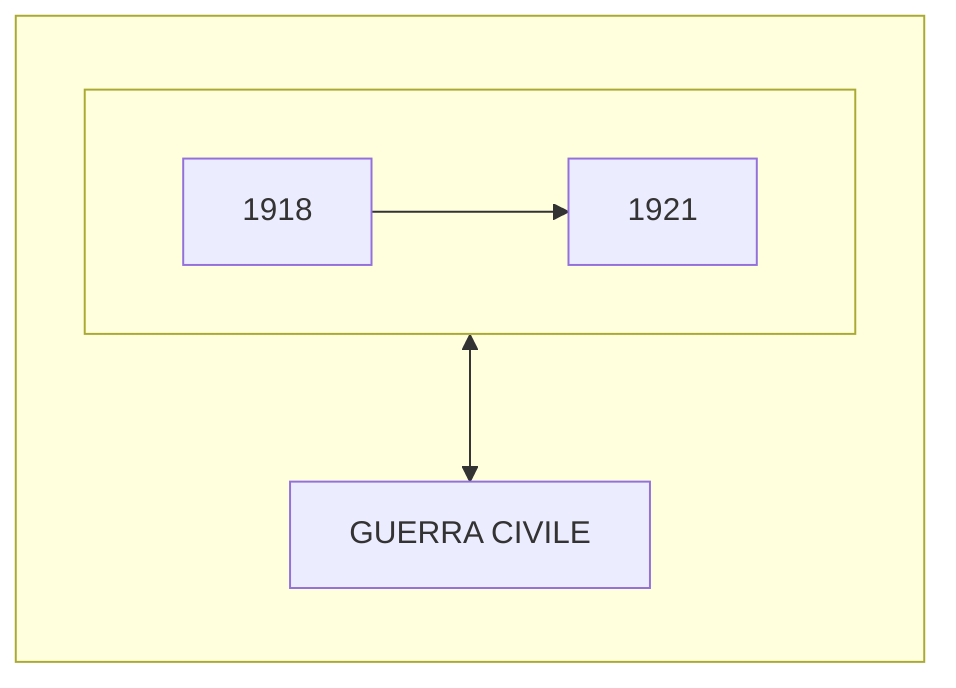

```mermaid
flowchart TB;
  subgraph 0[" "]
    direction TB;
    subgraph 01[" "]
      direction LR;
      010[1918]
      011[1921]
      010 --> 011
    end
    02[GUERRA CIVILE]
    01 <--> 02
  end
```