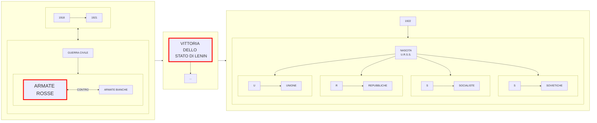

```mermaid
flowchart LR;
    subgraph 0[" "]
        direction TB;
        subgraph 01[" "]
            direction LR;
            010[1918]
            011[1921]
            010 --> 011
        end
        01 <--> 02

        subgraph 02[" "]
            direction TB;
            020[GUERRA CIVILE]
            subgraph 021[" "]
                direction LR;
                0210[ARMATE ROSSE]
                style 0210 stroke:#ff0000,stroke-width:5px, font-size:30px;
                0211[ARMATE BIANCHE]
                0210 <-->|CONTRO| 0211
            end
            020 --> 021
        end
    end

    subgraph 030[" "]
        1[VITTORIA DELLO <BR> STATO DI LENIN]
        10[...]
        1 --> 10
        style 1 stroke:#ff0000,stroke-width:5px, font-size:25px;
    end
    0 --> 030

    030 --> 2

    subgraph 2[" "]
      20[1922]
      subgraph 200[" "]
        direction TB;
        2000[NASCITA <br> U.R.S.S.]
        subgraph 21[" "]
          210[U]
          2100[UNIONE]
          210 --> 2100
        end
        subgraph 22[" "]
          220[R]
          2200[REPUBBLICHE]
          220 --> 2200
        end
        subgraph 23[" "]
          230[S]
          2300[SOCIALISTE]
          230 --> 2300
        end
        subgraph 24[" "]
          240[S]
          2400[SOVIETICHE]
          240 --> 2400
        end
        2000 --> 21 & 22 & 23 & 24
      end
      20 --> 200
    end
```