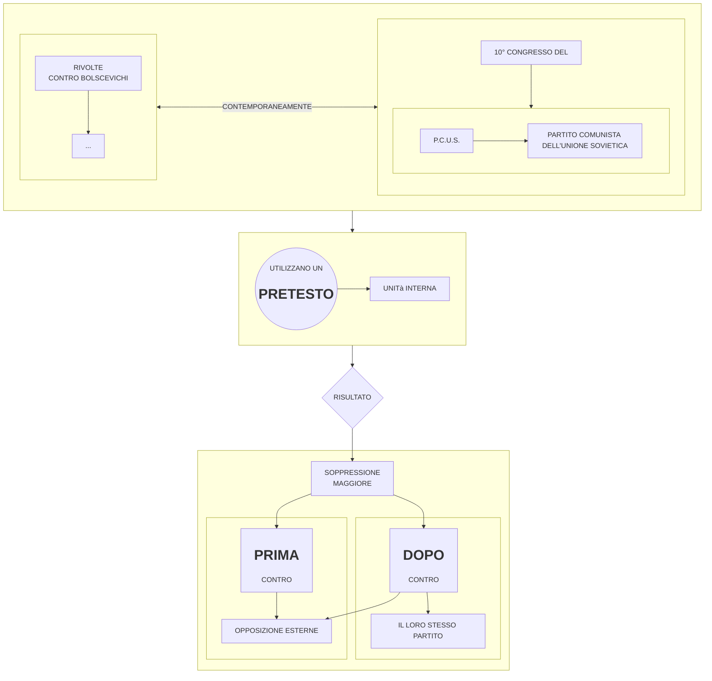

```mermaid
flowchart TB
  subgraph 0[" "]
    subgraph 01[" "]
      010[RIVOLTE <br> CONTRO BOLSCEVICHI]
      011[...]
      010 --> 011
    end
    subgraph 02[" "]
      direction TB
      020[10° CONGRESSO DEL]
      subgraph 023[" "]
        direction LR
        021[P.C.U.S.]
        0210[PARTITO COMUNISTA DELL'UNIONE SOVIETICA]
        021 --> 0210
      end
      020 --> 023
    end
    01 <----->|CONTEMPORANEAMENTE| 02
  end
  subgraph 2[" "]
    1((UTILIZZANO UN <br> <h1>PRETESTO</h1>))
    10[UNITà INTERNA]
  end
  0 --> 2
  1 --> 10
  3{RISULTATO}
  2 --> 3
  subgraph 4[" "]
    40[SOPPRESSIONE <BR> MAGGIORE]
    subgraph 43[" "]
      41[<h1>PRIMA</h1> CONTRO]
      410[OPPOSIZIONE ESTERNE]
    end
    subgraph 44[" "]
      42[<H1>DOPO</H1> CONTRO]
      420[IL LORO STESSO PARTITO]
    end
    40 --> 41 & 42
    41 --> 410
    42 --> 410 & 420
  end
  3 --> 40
```
