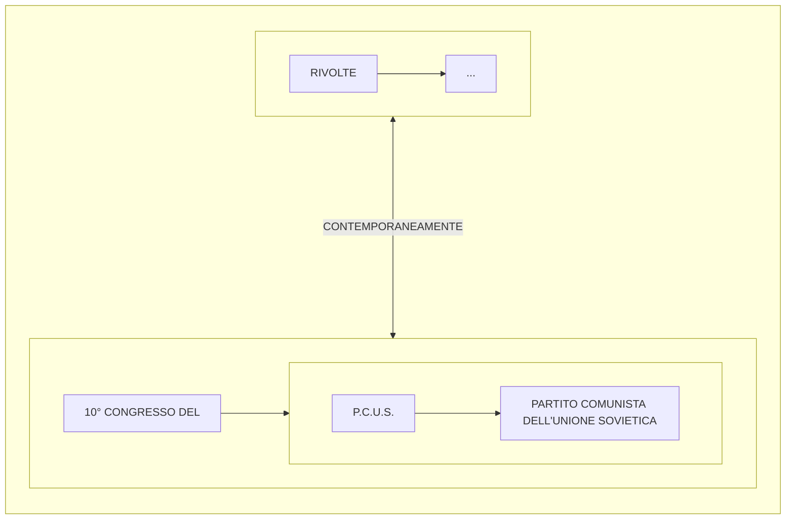

```mermaid
flowchart LR
  subgraph 0[" "]
    subgraph 01[" "]
      010[RIVOLTE]
      011[...]
      010 --> 011
    end
    subgraph 02[" "]
      020[10° CONGRESSO DEL]
      subgraph 023[" "]
        direction LR
        021[P.C.U.S.]
        0210[PARTITO COMUNISTA DELL'UNIONE SOVIETICA]
        021 --> 0210
      end
      020 --> 023
    end
    01 <----->|CONTEMPORANEAMENTE| 02
  end
```
