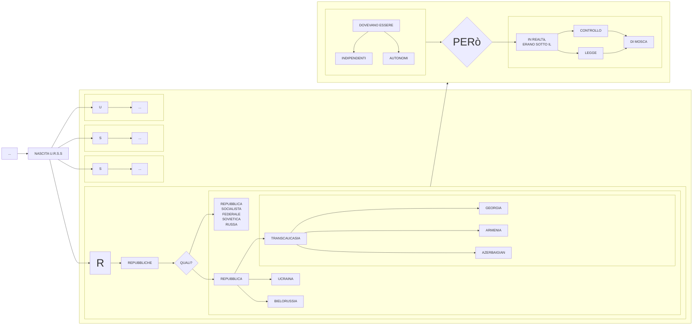

```mermaid
flowchart LR
  classDef classGrande font-size: 50px;
  0[...]
  1[NASCITA U.R.S.S]
  subgraph 15[" "]
    subgraph 10[" "]
      100[U]
      1000[...]
      100 --> 1000
    end
    subgraph 22[" "]
      220[R]:::classGrande
      2200[REPUBBLICHE]
      22000{QUALI?}
      subgraph 3[" "]
          30[REPUBBLICA <br> SOCIALISTA <br> FEDERALE <br> SOVIETICA <br> RUSSA]
          31[REPUBBLICA]
          310[UCRAINA]
          311[BIELORUSSIA]
          subgraph 4[" "]
              312[TRANSCAUCASIA]
              3120[GEORGIA]
              3121[ARMENIA]
              3122[AZERBAIGIAN]
          end
          312 --> 3120 & 3121 & 3122
          31 --> 310 & 311 & 312
      end
      220 --> 2200 --> 22000 --> 30 & 31
    end
    subgraph 12[" "]
      120[S]
      1200[...]
      120 --> 1200
    end
    subgraph 13[" "]
      130[S]
      1300[...]
      130 --> 1300
    end
  end
  0 --> 1 --> 100 & 220 & 120 & 130
  subgraph 6[" "]
    direction LR;
    subgraph 5[" "]
      51[DOVEVANO ESSERE]
      510[INDIPENDENTI]
      511[AUTONOMI]
      51 --> 510 & 511
    end
    50{PERò}:::classGrande
    subgraph 500[" "]
      7[IN REALTà, <br> ERANO SOTTO IL]
      70[CONTROLLO]
      71[LEGGE]
      8[DI MOSCA]
      7 --> 70 & 71 --> 8
    end
    500[SOTTO IL CONTROLLO E LA LEGGE DI MOSCA]:::classGrande
    5 --> 50 --> 7
  end
  22 --> 6
```