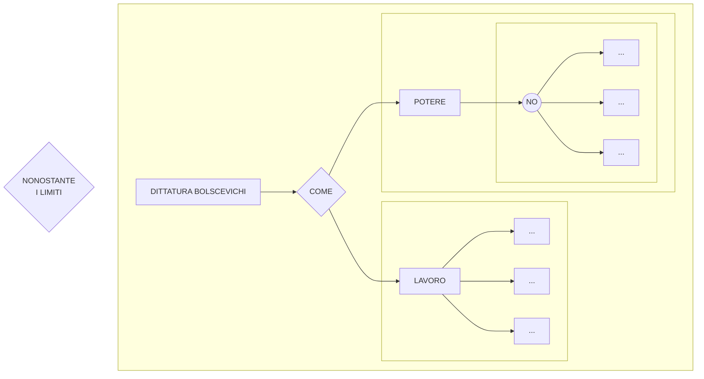

```mermaid
flowchart TB
  subgraph 04[" "]
    0[DITTATURA BOLSCEVICHI]
    01{COME}
    subgraph 02[" "]
      010[POTERE]
      subgraph 020[" "]
        0100((NO))
        01000[...]
        01001[...]
        01002[...]
      end
    end
    subgraph 03[" "]
      011[LAVORO]
      0110[...]
      0111[...]
      0112[...]
    end
    0 --> 01 --> 010 & 011
    010 --> 0100
    0100 --> 01000 & 01001 & 01002
    011 --> 0110 & 0111 & 0112
  end
  1{NONOSTANTE <br> I LIMITI}
```