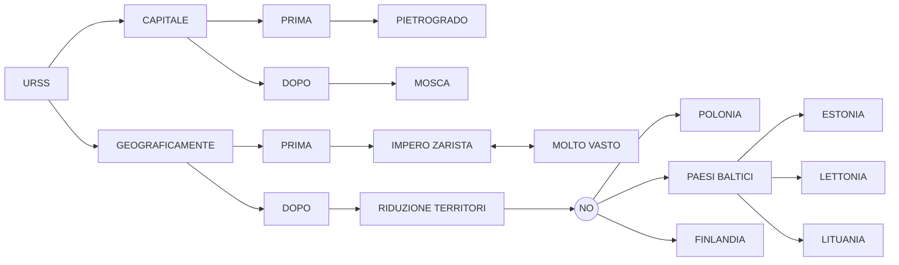

```mermaid
flowchart LR
    0[URSS]
    1[CAPITALE]
    10[PRIMA]
    100[PIETROGRADO]
    11[DOPO]
    110[MOSCA]
    2[GEOGRAFICAMENTE]
    20[PRIMA]
    200[IMPERO ZARISTA]
    201[MOLTO VASTO]
    200 <--> 201
    21[DOPO]
    210[RIDUZIONE TERRITORI]
    2100((NO))
    30[POLONIA]
    31[PAESI BALTICI]
    310[ESTONIA]
    311[LETTONIA]
    312[LITUANIA]
    32[FINLANDIA]
    0 --> 1 & 2
    1 --> 10 & 11
    10 --> 100
    11 --> 110
    2 --> 20 & 21
    20 --> 200
    21 --> 210
    210 --> 2100
    2100 --> 30 & 31 & 32
    31 --> 310 & 311 & 312


```