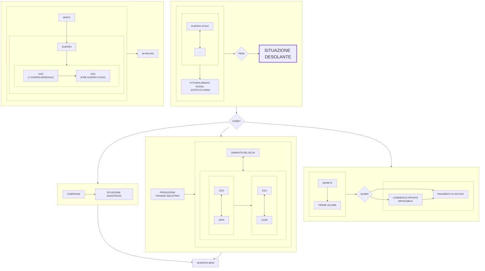

```mermaid
flowchart TB
    classDef classGrande font-size: 30px, stroke-width: 5px;
    subgraph 017[" "]
      subgraph 016[" "]
        subgraph 01[" "]
          010[GUERRA CIVILE]
          0100[...]
          010 <--> 0100
        end
        011["VITTORIA ARMATA ROSSA <br> (STATO DI LENIN)"]
        01 --> 011
      end
      016 --> 012 --> 013
      012{PERò}
      013[SITUAZIONE DESOLANTE]:::classGrande
    end
    %% 013 --> 014
       017 --> 014
    014{COME?}
    subgraph 2[" "]
      20[PRODUZIONE <br> ''GRANDE INDUSTRIA'']
      subgraph 21[" "]
        200[DIMINUITA DEL 86,2%]
        subgraph 210[" "]
          direction LR;
          subgraph 22[" "]
            direction TB;
            220[1913]
            221[100%]
            220 <-->221
          end
          subgraph 23[" "]
            direction TB;
            230[1921]
            231[13,8%]
            230 <--> 231
          end
          22 --> 23
        end
        200 <--> 210
      end
      20 --> 21
    end
    014 --> 2
    subgraph 3[" "]
      30[CAMPAGNE]
      31[SITUAZIONE DISASTROSA]
      30 --> 31
    end
    014 --> 3
    4[SCARSITà BENI]
    3 & 2 --> 4
    subgraph 5[" "]
      subgraph 50[" "]
        500[MONETA]
        501[PERDE VALORE]
        500 --> 501
      end
      51{QUINDI}
      subgraph 54[" "]
        52[PAGAMENTI IN NATURA]
        53[COMMERCIO PRIVATO <br> IMPOSSIBILE]
      end
      50 --> 51 --> 52 & 53
      53 --> 52
    end
    014 --> 5
    subgraph 6[" "]
      subgraph 7[" "]
        70[MORTI]
        subgraph 8[" "]
          direction TB;
          80[GUERRA]
          subgraph 9[" "]
            direction LR;
            90["1914 <br> (1 GUERRA MONDIALE)"]
            91["1921 <BR> (FINE GUERRA CIVILE)"]
          end
        end
      end
      60[28 MILIONI]
      70 --> 80
      80 --> 9
      90 --> 91
      7 --> 60
    end
```