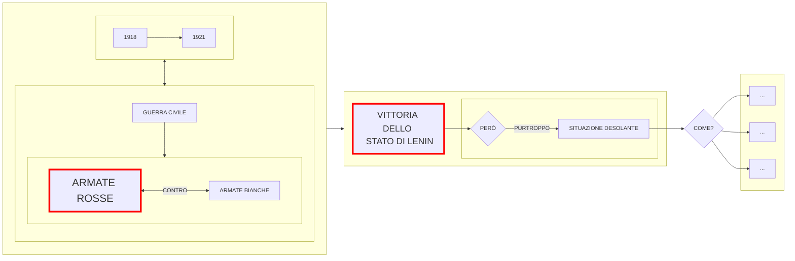

```mermaid
flowchart LR;
  subgraph 0[" "]
    direction TB;
    subgraph 01[" "]
      direction LR;
      010[1918]
      011[1921]
      010 --> 011
    end
    01 <--> 02

    subgraph 02[" "]
      direction TB;
      020[GUERRA CIVILE]
      subgraph 021[" "]
        direction LR;
        0210[ARMATE ROSSE]
        style 0210 stroke:#ff0000,stroke-width:5px, font-size:30px;
        0211[ARMATE BIANCHE]
        0210 <-->|CONTRO| 0211
      end
      020 --> 021
    end
  end

  subgraph 3[" "]
    1[VITTORIA DELLO <BR> STATO DI LENIN]
    style 1 stroke:#ff0000,stroke-width:5px, font-size:25px;
    subgraph 30[" "]
      2{PERÒ}
      20[SITUAZIONE DESOLANTE]
    end
    1 --> 2 -->|PURTROPPO| 20
  end
  0 --> 3

  4{COME?}
  20 --> 4
  subgraph 5[" "]
    50[...]
    51[...]
    53[...]
  end
  4 --> 50 & 51 & 53

```