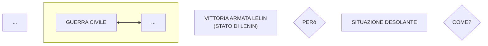

```mermaid
flowchart TB
    0[...]
    subgraph 01[" "]
      010[GUERRA CIVILE]
      0100[...]
      010 <--> 0100
    end
    011["VITTORIA ARMATA LELIN <br> (STATO DI LENIN)"]
    012{PERò}
    013[SITUAZIONE DESOLANTE]
    014{COME?}
```