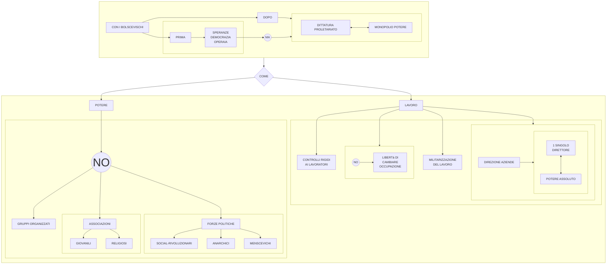

```mermaid
flowchart TB
  subgraph 42[" "]
    0[CON I BOLSCEVISCHI]
    subgraph 3[" "]
      1[PRIMA]
      10[SPERANZE <br> DEMOCRAZIA <br> OPERAIA]
      1 --> 10
    end
    2[DOPO]
    0 --> 1 & 2
    subgraph 4[" "]
      40[DITTATURA PROLETARIATO]
      400[MONOPOLIO POTERE]
      40 <--> 400
    end
    2 --> 4
    41((MA))
    10 --> 41 --> 4
  end
  5{COME}
  42 --> 5
  5 --> 69 & 89
  subgraph 7[" "]
    69[POTERE]
    89[LAVORO]
    69 --> 60
    89 --> 80 & 81 & 82 & 83
    subgraph 6[" "]
      60((NO))
      style 60 font-size: 60px;
      61[GRUPPI ORGANIZZATI]
      subgraph 64[" "]
        62[ASSOCIAZIONI]
        620[GIOVANILI]
        621[RELIGIOSI]
      end
      subgraph 65[" "]
        63[FORZE POLITICHE]
        630[SOCIAL-RIVOLUZIONARI]
        631[ANARCHICI]
        632[MENSCEVICHI]
      end
      60 --> 61 & 62 & 63
      63 --> 630 & 631 & 632
      62 --> 620 & 621
    end
    subgraph 8[" "]
      80[CONTROLLI RIGIDI <br> AI LAVORATORI]
      subgraph 81[" "]
        810((NO))
        8100[LIBERTà DI <br> CAMBIARE <br> OCCUPAZIONE]
        810 --> 8100
      end
      82[MILITARIZZAZIONE <br> DEL LAVORO]
      subgraph 83[" "]
        830[DIREZIONE AZIENDE]
        subgraph 831[" "]
          832[1 SINGOLO <br> DIRETTORE]
          833[POTERE ASSOLUTO]
          832 <--> 833
        end
        830 --> 831
      end
    end
  end
```