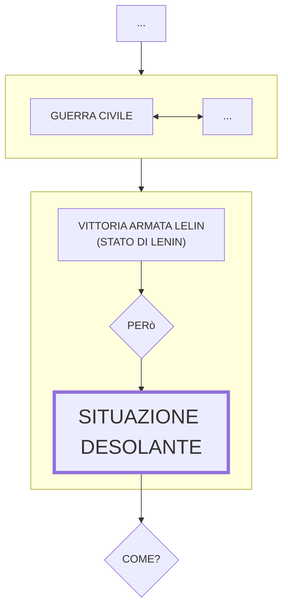

```mermaid
flowchart TB
    classDef classGrande font-size: 30px, stroke-width: 5px;
    0[...]
    subgraph 01[" "]
      010[GUERRA CIVILE]
      0100[...]
      010 <--> 0100
    end
    subgraph 015[" "]
      011["VITTORIA ARMATA LELIN <br> (STATO DI LENIN)"]
      012{PERò}
      013[SITUAZIONE DESOLANTE]:::classGrande
    end
    014{COME?}
    0 --> 01 --> 015 
    011 --> 012 --> 013 --> 014
```