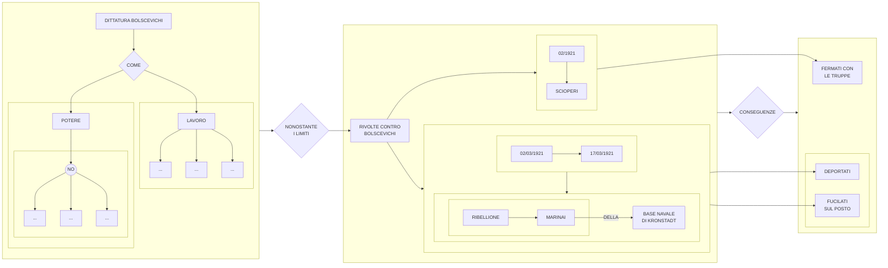

```mermaid
flowchart LR
  subgraph 04[" "]
    0[DITTATURA BOLSCEVICHI]
    01{COME}
    subgraph 02[" "]
      010[POTERE]
      subgraph 020[" "]
        0100((NO))
        01000[...]
        01001[...]
        01002[...]
      end
    end
    subgraph 03[" "]
      011[LAVORO]
      0110[...]
      0111[...]
      0112[...]
    end
    0 --> 01 --> 010 & 011
    010 --> 0100
    0100 --> 01000 & 01001 & 01002
    011 --> 0110 & 0111 & 0112
  end
  1{NONOSTANTE <br> I LIMITI}
  04 --> 1
  subgraph 10[" "]
    100[RIVOLTE CONTRO <br> BOLSCEVICHI]
    subgraph 21[" "]
      20[02/1921]
      200[SCIOPERI]
      20 --> 200
    end
    subgraph 22[" "]
      direction TB;
      subgraph 220[" "]
        direction LR;
        2200[02/03/1921]
        2201[17/03/1921]
        2200 --> 2201
      end
      subgraph 221[" "]
        subgraph 222[" "]
          2220[RIBELLIONE]
          2221[MARINAI]
        end
        223[BASE NAVALE <br> DI KRONSTADT]
        2220 --> 2221
        2221 -->|DELLA| 223
      end
      220 --> 221
    end
    100 --> 21 & 22
  end
  1 --> 100
  subgraph 3[" "]
    31[FERMATI CON <br> LE TRUPPE]
    subgraph 32[" "]
      320[DEPORTATI]
      321[FUCILATI <br> SUL POSTO]
    end
  end
  4{CONSEGUENZE}
  21 --> 31
  10 --> 4 --> 3
  22 --> 320 & 321
```