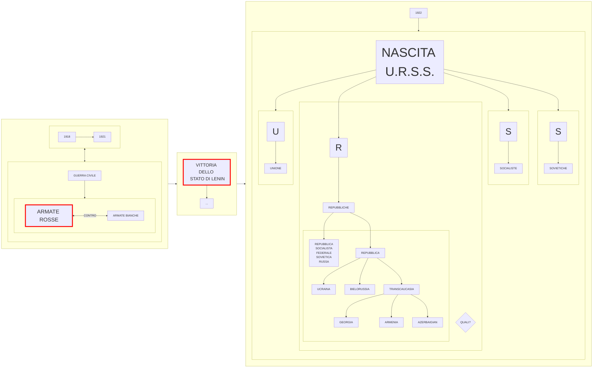

```mermaid
flowchart LR;
    classDef classGrande font-size: 50px;
    classDef classMoltoGrande font-size: 70px;
    subgraph 0[" "]
        direction TB;
        subgraph 01[" "]
            direction LR;
            010[1918]
            011[1921]
            010 --> 011
        end
        01 <--> 02

        subgraph 02[" "]
            direction TB;
            020[GUERRA CIVILE]
            subgraph 021[" "]
                direction LR;
                0210[ARMATE ROSSE]
                style 0210 stroke:#ff0000,stroke-width:5px, font-size:30px;
                0211[ARMATE BIANCHE]
                0210 <-->|CONTRO| 0211
            end
            020 --> 021
        end
    end

    subgraph 030[" "]
        1[VITTORIA DELLO <BR> STATO DI LENIN]
        10[...]
        1 --> 10
        style 1 stroke:#ff0000,stroke-width:5px, font-size:25px;
    end
    0 --> 030

    030 --> 2

    subgraph 2[" "]
      20[1922]
      subgraph 200[" "]
        direction TB;
        2000[NASCITA U.R.S.S.]:::classMoltoGrande
        subgraph 21[" "]
          direction TB;
          210[U]:::classGrande
          2100[UNIONE]
          210 --> 2100
        end
        subgraph 22[" "]
          direction TB;
          220[R]:::classGrande
          2200[REPUBBLICHE]
          22000{QUALI?}
          subgraph 3[" "]
            30[REPUBBLICA <br> SOCIALISTA <br> FEDERALE <br> SOVIETICA <br> RUSSA]
            31[REPUBBLICA]
            310[UCRAINA]
            311[BIELORUSSIA]
            312[TRANSCAUCASIA]
            3120[GEORGIA]
            3121[ARMENIA]
            3122[AZERBAIGIAN]
            312 --> 3120 & 3121 & 3122
            31 --> 310 & 311 & 312
          end
          220 --> 2200 --> 30 & 31
        end
        subgraph 23[" "]
          direction TB;
          230[S]:::classGrande
          2300[SOCIALISTE]
          230 --> 2300
        end
        subgraph 24[" "]
          direction TB;
          240[S]:::classGrande
          2400[SOVIETICHE]
          240 --> 2400
        end
        2000 --> 21 & 220 & 23 & 24
      end
      20 --> 200
    end
```