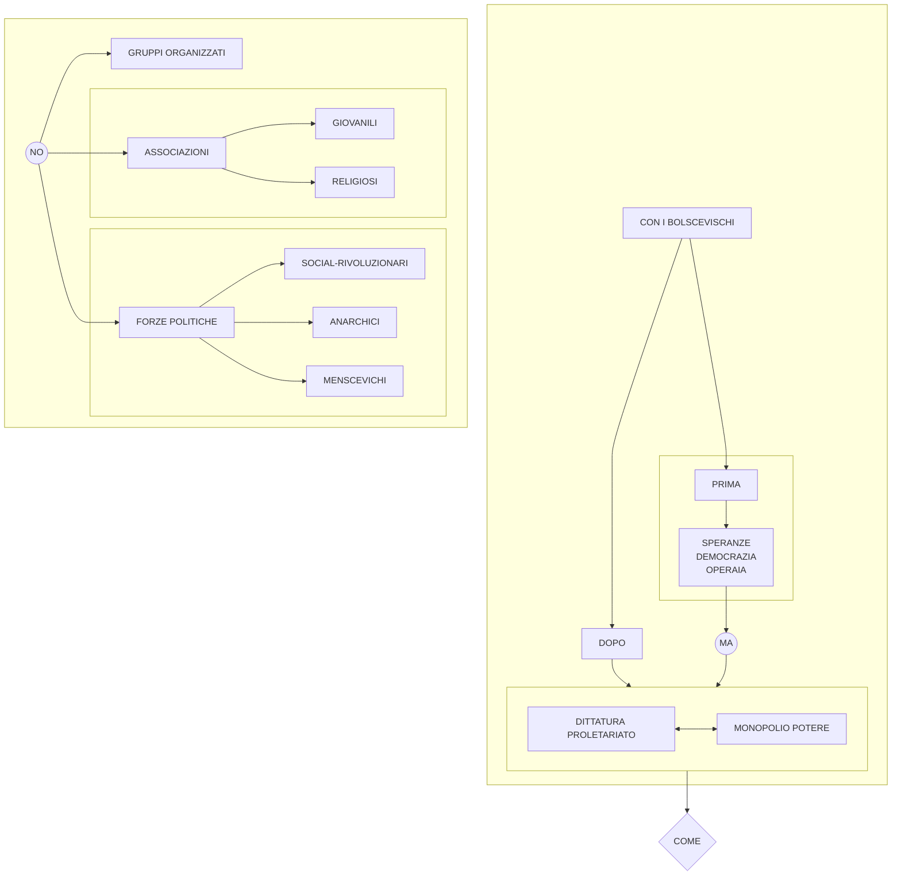

```mermaid
flowchart TB
  subgraph 42[" "]
    0[CON I BOLSCEVISCHI]
    subgraph 3[" "]
      1[PRIMA]
      10[SPERANZE <br> DEMOCRAZIA <br> OPERAIA]
      1 --> 10
    end
    2[DOPO]
    0 --> 1 & 2
    subgraph 4[" "]
      40[DITTATURA PROLETARIATO]
      400[MONOPOLIO POTERE]
      40 <--> 400
    end
    2 --> 4
    41((MA))
    10 --> 41 --> 4
  end
  5{COME}
  4 --> 5
  subgraph 6[" "]
    60((NO))
    61[GRUPPI ORGANIZZATI]
    subgraph 64[" "]
      62[ASSOCIAZIONI]
      620[GIOVANILI]
      621[RELIGIOSI]
    end
    subgraph 65[" "]
      63[FORZE POLITICHE]
      630[SOCIAL-RIVOLUZIONARI]
      631[ANARCHICI]
      632[MENSCEVICHI]
    end
    60 --> 61 & 62 & 63
    63 --> 630 & 631 & 632
    62 --> 620 & 621
  end
```