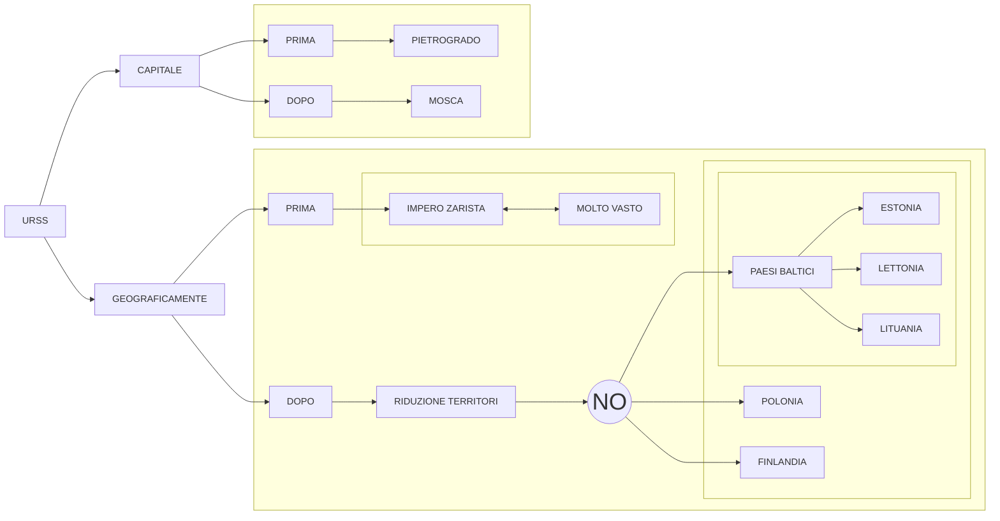

```mermaid
flowchart LR
    0[URSS]
    
    1[CAPITALE]
    subgraph 4[" "]
        10[PRIMA]
        100[PIETROGRADO]
        11[DOPO]
        110[MOSCA]
    end

    2[GEOGRAFICAMENTE]

    subgraph 5[" "]
        20[PRIMA]

        subgraph 6[" "]
          200[IMPERO ZARISTA]
          201[MOLTO VASTO]
          200 <--> 201
        end

        21[DOPO]

        210[RIDUZIONE TERRITORI]
        2100((NO))
        style 2100 font-size: 40px;

        subgraph 7[" "]
          30[POLONIA]

          subgraph 8[" "]
            31[PAESI BALTICI]
            310[ESTONIA]
            311[LETTONIA]
            312[LITUANIA]
          end

          32[FINLANDIA]
        end
    end

    0 --> 1 & 2
    1 --> 10 & 11
    10 --> 100
    11 --> 110
    2 --> 20 & 21
    20 --> 200
    21 --> 210
    210 --> 2100
    2100 --> 30 & 31 & 32
    31 --> 310 & 311 & 312


```