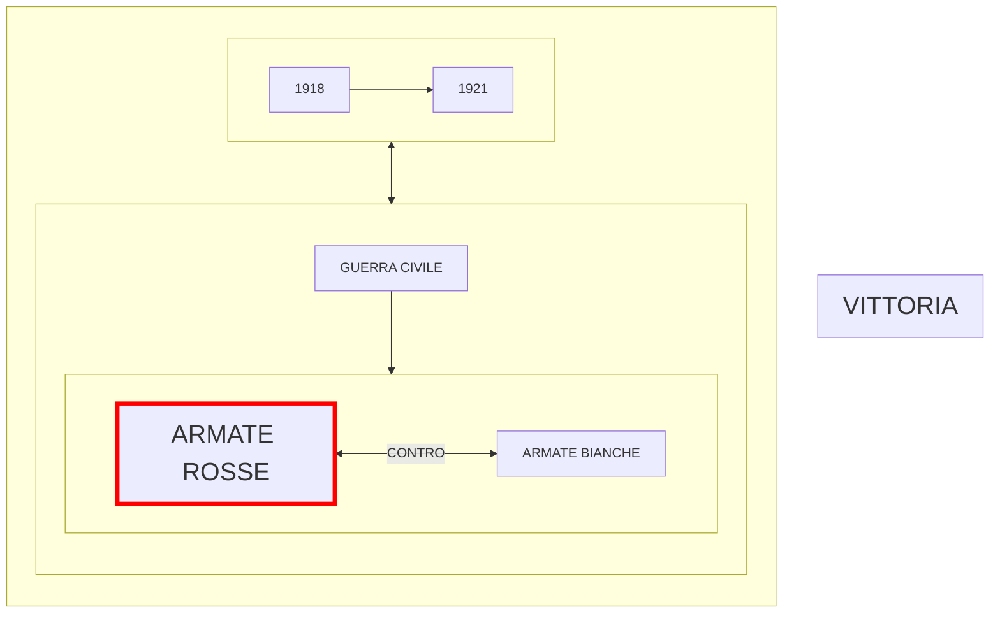

```mermaid
flowchart TB;
  subgraph 0[" "]
    direction TB;
    subgraph 01[" "]
      direction LR;
      010[1918]
      011[1921]
      010 --> 011
    end
    01 <--> 02

    subgraph 02[" "]
      direction TB;
      020[GUERRA CIVILE]
      subgraph 021[" "]
        direction LR;
        0210[ARMATE ROSSE]
        style 0210 stroke:#ff0000,stroke-width:5px, font-size:30px;
        0211[ARMATE BIANCHE]
        0210 <-->|CONTRO| 0211
      end
      020 --> 021
    end
  end
  1[VITTORIA]
  style 1 font-size:30px;
```