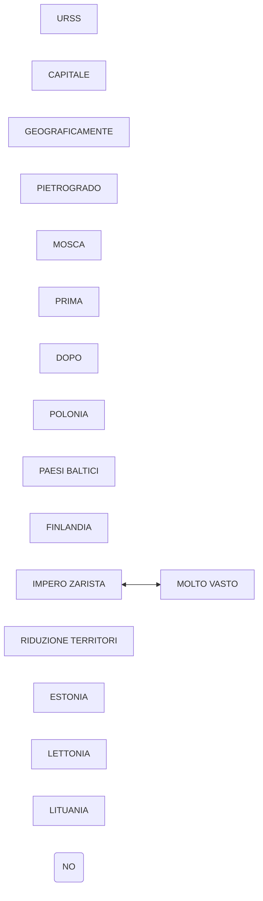

```mermaid
flowchart LR
    0[URSS]
    1[CAPITALE]
    10[PIETROGRADO]
    11[MOSCA]
    2[GEOGRAFICAMENTE]
    20[PRIMA]
    200[IMPERO ZARISTA]
    201[MOLTO VASTO]
    200 <--> 201
    21[DOPO]
    210[RIDUZIONE TERRITORI]
    2100(NO)
    30[POLONIA]
    31[PAESI BALTICI]
    310[ESTONIA]
    311[LETTONIA]
    312[LITUANIA]
    32[FINLANDIA]
```