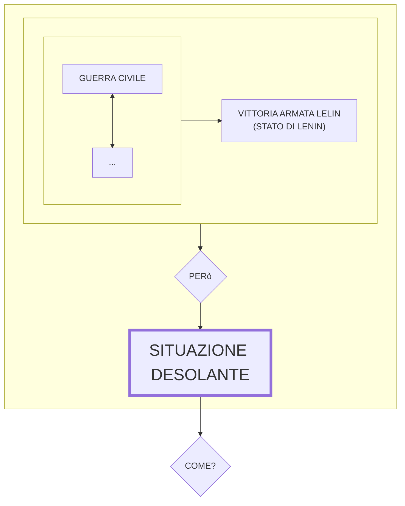

```mermaid
flowchart TB
    classDef classGrande font-size: 30px, stroke-width: 5px;
    subgraph 017[" "]
      subgraph 016[" "]
        subgraph 01[" "]
          010[GUERRA CIVILE]
          0100[...]
          010 <--> 0100
        end
        011["VITTORIA ARMATA LELIN <br> (STATO DI LENIN)"]
        01 --> 011
      end
      016 --> 012 --> 013
      012{PERò}
      013[SITUAZIONE DESOLANTE]:::classGrande
    end
    013 --> 014
    014{COME?}
```