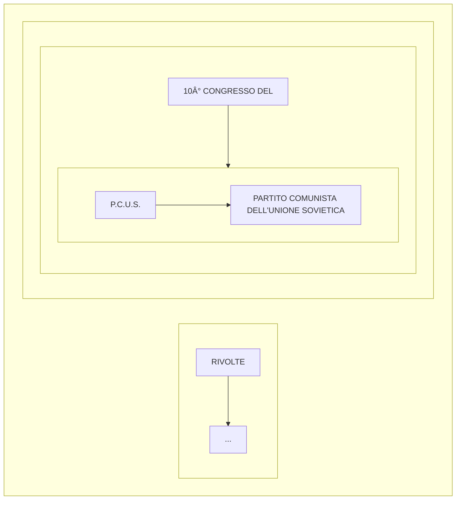

```mermaid
flowchart TB
  subgraph 0[" "]
    subgraph 01[" "]
      010[RIVOLTE]
      011[...]
      010 --> 011
    end
    subgraph 02[" "]
      subgraph 022[" "]
        020[10° CONGRESSO DEL]
        subgraph 023[" "]
          direction LR
          021[P.C.U.S.]
          0210[PARTITO COMUNISTA DELL'UNIONE SOVIETICA]
          021 --> 0210
        end
        020 --> 023
      end
    end
  end
```