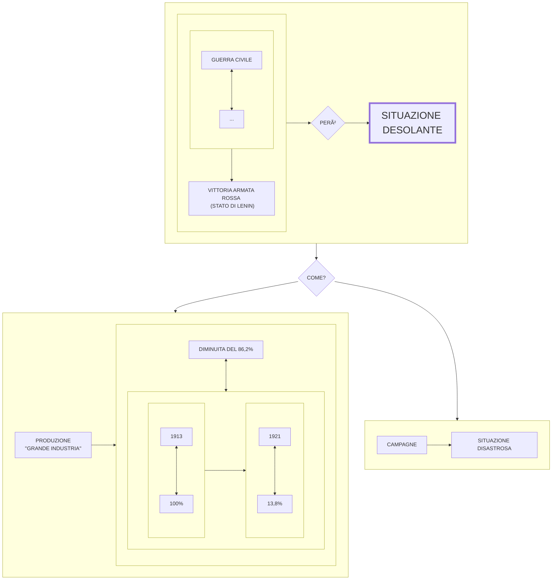

```mermaid
flowchart TB
    classDef classGrande font-size: 30px, stroke-width: 5px;
    subgraph 017[" "]
      subgraph 016[" "]
        subgraph 01[" "]
          010[GUERRA CIVILE]
          0100[...]
          010 <--> 0100
        end
        011["VITTORIA ARMATA ROSSA <br> (STATO DI LENIN)"]
        01 --> 011
      end
      016 --> 012 --> 013
      012{PERò}
      013[SITUAZIONE DESOLANTE]:::classGrande
    end
    %% 013 --> 014
       017 --> 014
    014{COME?}
    subgraph 2[" "]
      20[PRODUZIONE <br> ''GRANDE INDUSTRIA'']
      subgraph 21[" "]
        200[DIMINUITA DEL 86,2%]
        subgraph 210[" "]
          direction LR;
          subgraph 22[" "]
            direction TB;
            220[1913]
            221[100%]
            220 <-->221
          end
          subgraph 23[" "]
            direction TB;
            230[1921]
            231[13,8%]
            230 <--> 231
          end
          22 --> 23
        end
        200 <--> 210
      end
      20 --> 21
    end
    014 --> 2
    subgraph 3[" "]
      30[CAMPAGNE]
      31[SITUAZIONE DISASTROSA]
      30 --> 31
    end
    014 --> 3
```