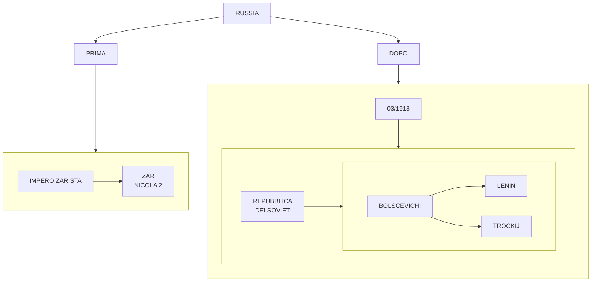
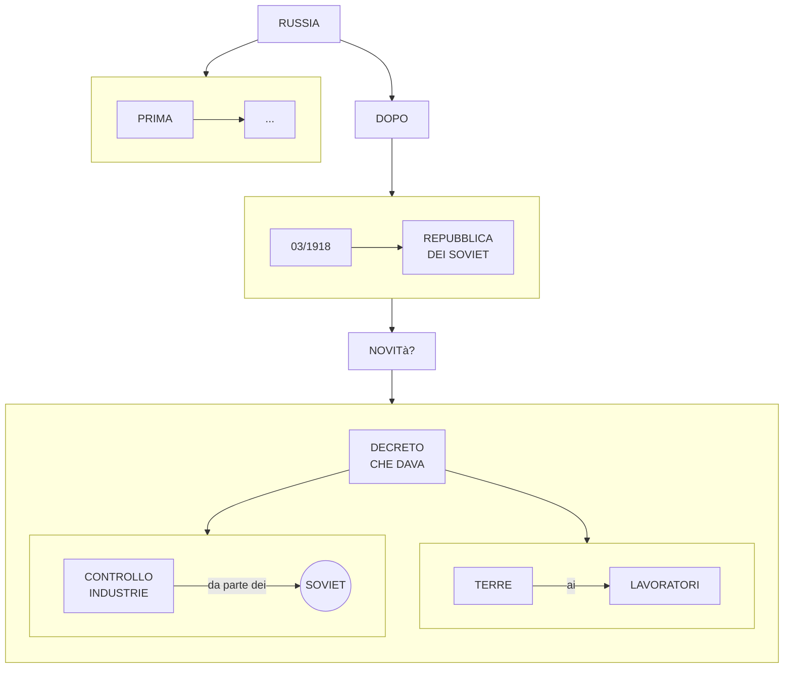

```mermaid
flowchart TB
    0[RUSSIA]
    01[PRIMA]
    subgraph 010[" "]
        0100[IMPERO ZARISTA]
        01000[ZAR<br>NICOLA 2]
        0100 --> 01000
    end
    02[DOPO]
    subgraph 020[" "]
        direction TB
        0200[03/1918]
        subgraph 022[" "]
            direction LR
            02000[REPUBBLICA <br> DEI SOVIET]
            subgraph 021[" "]
                0210[BOLSCEVICHI]
                02100[LENIN]
                02101[TROCKIJ]
                0210 --> 02100 & 02101
            end
            02000 --> 021
        end
        0200 --> 022
    end
    0 --> 01 & 02
    01 --> 010
    02 --> 020
```

----

```mermaid
flowchart TB
    0[RUSSIA]
    subgraph 01[" "]
        010[PRIMA] -->
        0100[...]
    end
    02[DOPO]
    subgraph 020[" "]
        0200[03/1918] -->
        02000[REPUBBLICA <br> DEI SOVIET]
    end
    03[NOVITà?]
    subgraph 033[" "]
        direction TB
        030[DECRETO <br> CHE DAVA]
        subgraph 031[" "]
            0310[TERRE] --> |ai| 03100[LAVORATORI]
        end
        subgraph 032[" "]
            0320[CONTROLLO<br>INDUSTRIE]
            03200((SOVIET))
            0320 -->|da parte dei| 03200
        end
        030 --> 031 & 032
    end
    0 --> 01
    0 --> 02 --> 020
    020 --> 03 --> 033
```

----

