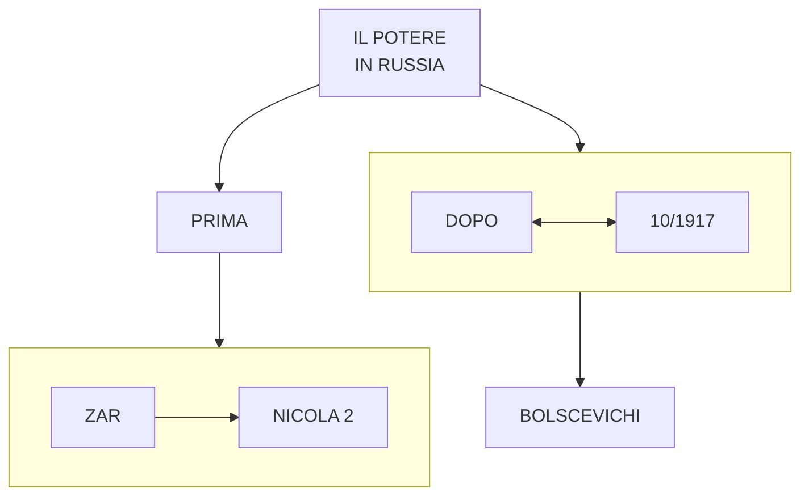

```mermaid
flowchart TB
    0[IL POTERE <br> IN RUSSIA]
    01[PRIMA]
    subgraph 010[" "]
        0100[ZAR]
        01000[NICOLA 2]
        0100 --> 01000
    end
    subgraph 02[" "]
        020[DOPO]
        0200[10/1917]
        020 <--> 0200
    end
    021[BOLSCEVICHI]
    0 --> 01 & 02
    01 --> 010
    02 --> 021
```

----
