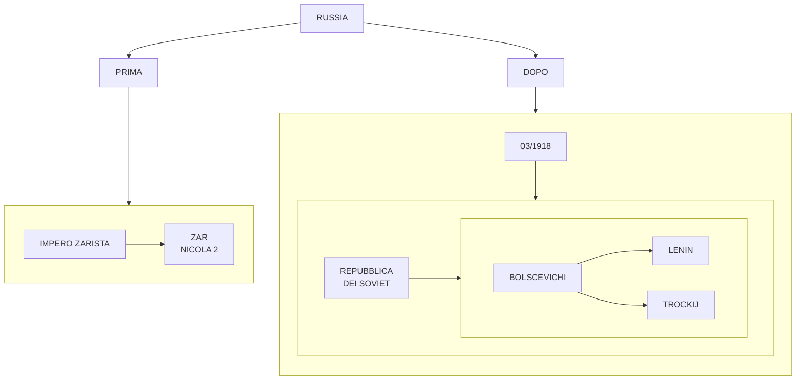
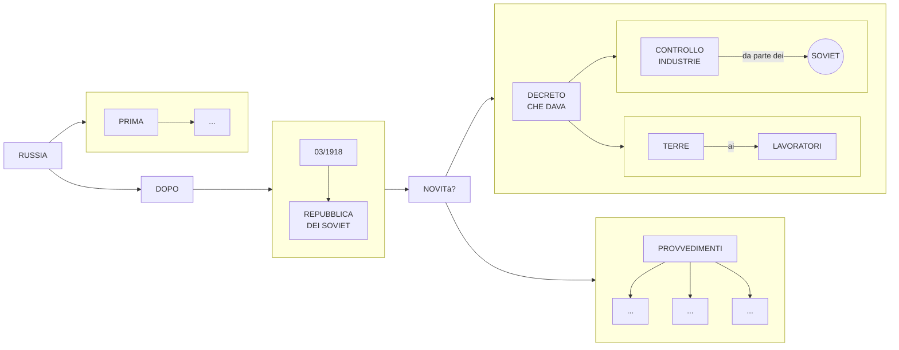
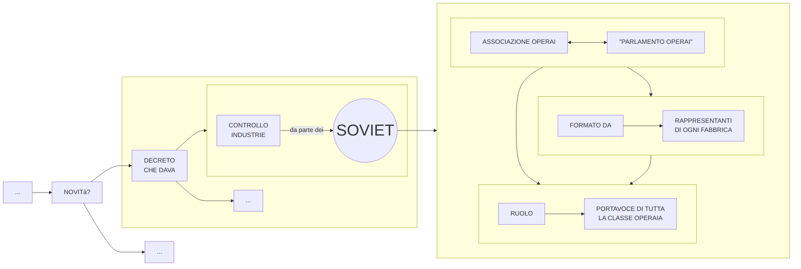
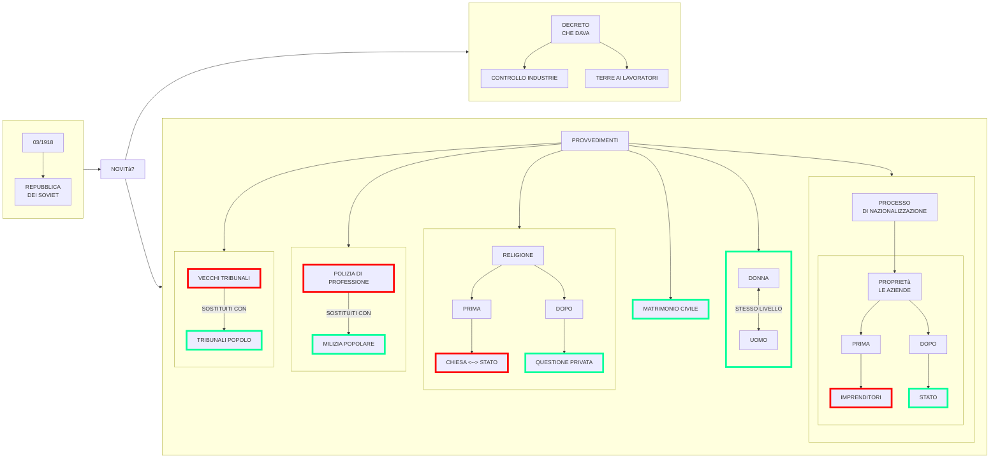
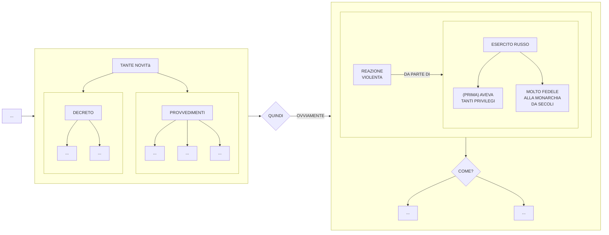
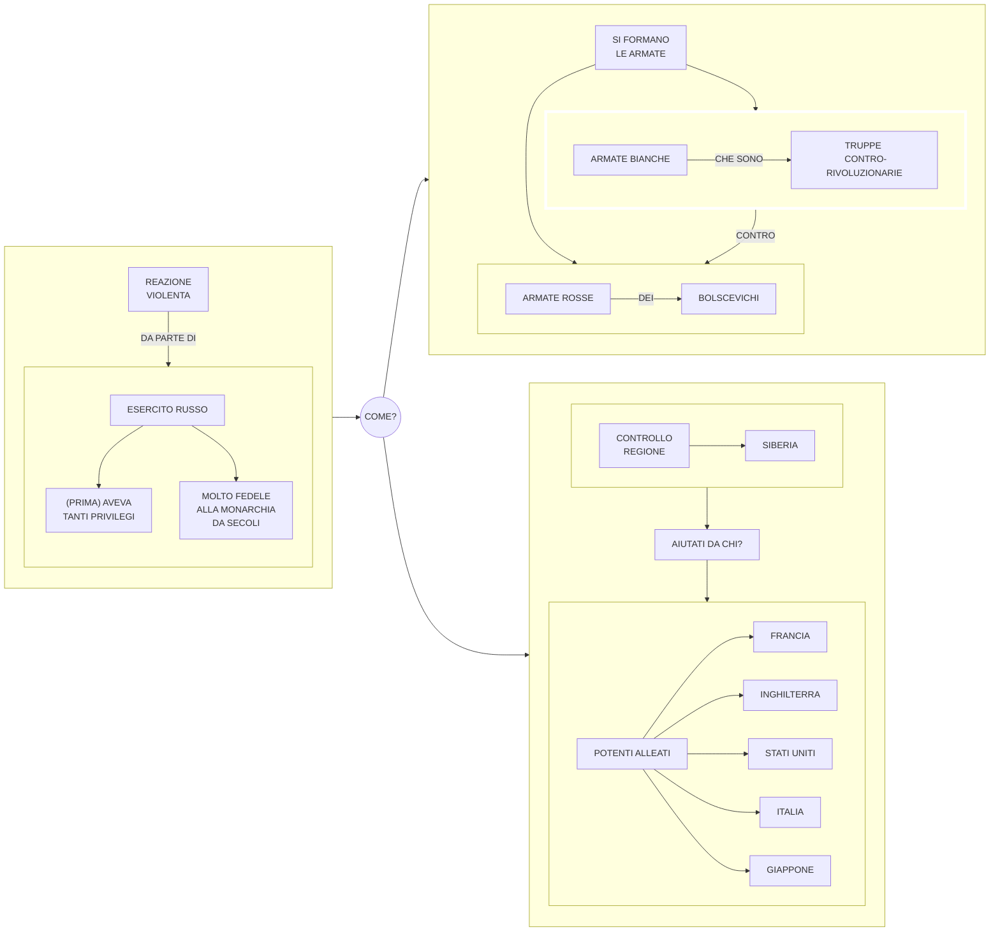

```mermaid
flowchart TB
    0[RUSSIA]
    01[PRIMA]
    subgraph 010[" "]
        0100[IMPERO ZARISTA]
        01000[ZAR<br>NICOLA 2]
        0100 --> 01000
    end
    02[DOPO]
    subgraph 020[" "]
        direction TB
        0200[03/1918]
        subgraph 022[" "]
            direction LR
            02000[REPUBBLICA <br> DEI SOVIET]
            subgraph 021[" "]
                0210[BOLSCEVICHI]
                02100[LENIN]
                02101[TROCKIJ]
                0210 --> 02100 & 02101
            end
            02000 --> 021
        end
        0200 --> 022
    end
    0 --> 01 & 02
    01 --> 010
    02 --> 020
```

----

```mermaid
flowchart LR
    0[RUSSIA]
    subgraph 01[" "]
        direction LR
        010[PRIMA] -->
        0100[...]
    end
    02[DOPO]
    subgraph 020[" "]
        0200[03/1918] -->
        02000[REPUBBLICA <br> DEI SOVIET]
    end
    03[NOVITà?]
    subgraph 033[" "]
        direction LR
        030[DECRETO <br> CHE DAVA]
        subgraph 031[" "]
            direction LR
            0310[TERRE] --> |ai| 03100[LAVORATORI]
        end
        subgraph 032[" "]
            direction LR
            0320[CONTROLLO<br>INDUSTRIE]
            03200((SOVIET))
            0320 -->|da parte dei| 03200
        end
        030 --> 031 & 032
    end
    subgraph 036[" "]
        035[PROVVEDIMENTI]
        0350[...]
        0351[...]
        0352[...]
    end
    035 --> 0350 & 0351 & 0352;
    0 --> 01
    0 --> 02 --> 020
    020 --> 03 --> 033 & 036
```

----

```mermaid
flowchart LR
    0[...] 
    01[NOVITà?]
    subgraph 013[" "]
        010[DECRETO <br> CHE DAVA]
        011[...]
        subgraph 012[" "]
            0120[CONTROLLO<br>INDUSTRIE]
            style 01200 font-size:40px;
            01200((SOVIET))
            0120 -->|da parte dei| 01200
        end
        010 --> 011 & 012
    end
    014[...]
    subgraph 05[" "]
        subgraph 02[" "]
            020[ASSOCIAZIONE OPERAI]
            021["''PARLAMENTO OPERAI''"]
            020 <-->021
        end
        subgraph 03[" "]
            030[FORMATO DA]
            0300[RAPPRESENTANTI <BR> DI OGNI FABBRICA]
            030 --> 0300
        end
        subgraph 04[" "]
            040[RUOLO]
            0400[PORTAVOCE DI TUTTA <BR> LA CLASSE OPERAIA]
            040 --> 0400
        end
    end
    02 --> 03 & 04
    03 --> 04
    01200 --> 05
    0 --> 01 --> 010 & 014
```

----

```mermaid
flowchart LR
    subgraph 0[" "]
        00[03/1918] -->
        000[REPUBBLICA <br> DEI SOVIET]
    end
    01[NOVITà?]
    subgraph 013[" "]
        direction TB;
        010[DECRETO <br> CHE DAVA]
        011[CONTROLLO INDUSTRIE]
        012[TERRE AI LAVORATORI]
        010 --> 011 & 012
    end
    subgraph 014[" "]
        1[PROVVEDIMENTI]
        subgraph 10[" "]
            100[VECCHI TRIBUNALI]
            style 100 stroke:#ff0000, stroke-width:5px;
            101[TRIBUNALI POPOLO]
            style 101 stroke:#00ff99, stroke-width:5px;
            100 -->|SOSTITUITI CON| 101
        end
        subgraph 11[" "]
            110[POLIZIA DI PROFESSIONE]
            style 110 stroke:#ff0000, stroke-width:5px;
            111[MILIZIA POPOLARE]
            style 111 stroke:#00ff99, stroke-width:5px;
            110 -->|SOSTITUITI CON| 111
        end
        subgraph 12[" "]
            120[RELIGIONE]
            1200[PRIMA]
            12000[CHIESA <--> STATO]
            style 12000 stroke:#ff0000, stroke-width:5px;
            1201[DOPO]
            12010[QUESTIONE PRIVATA]
            style 12010 stroke:#00ff99, stroke-width:5px;
            120 --> 1200 & 1201
            1201 --> 12010
            1200 --> 12000
        end
        13[MATRIMONIO CIVILE]
        style 13 stroke:#00ff99, stroke-width:5px;
        subgraph 14[" "]
            140[DONNA]
            141[UOMO]
            140 <-->|STESSO LIVELLO| 141
        end
        subgraph 15[" "]
            150[PROCESSO <br> DI NAZIONALIZZAZIONE]
            subgraph 151[" "]
                1510[PROPRIETà <BR> LE AZIENDE]
                15100[PRIMA]
                151000[IMPRENDITORI]
                style 151000 stroke:#ff0000, stroke-width:5px;
                15101[DOPO]
                151010[STATO]
                style 151010 stroke:#00ff99, stroke-width:5px;
                1510 --> 15100 & 15101
                15100 --> 151000
                15101 --> 151010
            end
            150 --> 1510
        end
        style 14 stroke:#00ff99, stroke-width:5px;
        1 --> 10 & 11 & 12 & 13 & 14 & 15
    end
    0 --> 01 --> 013 & 014
```

---

```mermaid
flowchart LR
    03[...]
    subgraph 0[" "]
        01[TANTE NOVITà]
        subgraph 010[" "]
            direction TB;
            0100[PROVVEDIMENTI]
            01000[...]
            01001[...]
            01002[...]
            0100 --> 01000 & 01001 & 01002
        end
        subgraph 011[" "]
            direction TB;
            0110[DECRETO]
            01100[...]
            01101[...]
            0110 --> 01100 & 01101
        end
        01 --> 010 & 011
    end
    02{QUINDI}
    03 --> 0 --> 02
    subgraph 022[" "]
        subgraph 020[" "]
            0200[REAZIONE <br> VIOLENTA]
            subgraph 021[" "]
                direction TB;
                0210[ESERCITO RUSSO]
                02100["(PRIMA) AVEVA <BR> TANTI PRIVILEGI"]
                02101[MOLTO FEDELE <BR> ALLA MONARCHIA <BR> DA SECOLI]
                0210 --> 02100 & 02101
            end
            0200 -->|DA PARTE DI| 021
        end
        04{COME?}
        040[...]
        041[...]
        04 --> 040 & 041
        020 --> 04  
    end
    02 -->|OVVIAMENTE| 022
```

----

```mermaid
flowchart LR
    subgraph 020[" "]
        0200[REAZIONE <br> VIOLENTA]
        subgraph 021[" "]
            direction TB;
            0210[ESERCITO RUSSO]
            02100["(PRIMA) AVEVA <BR> TANTI PRIVILEGI"]
            02101[MOLTO FEDELE <BR> ALLA MONARCHIA <BR> DA SECOLI]
            0210 --> 02100 & 02101
        end
        0200 -->|DA PARTE DI| 021
    end
    04((COME?))
    04 --> 1 & 2
    020 --> 04  
    subgraph 1[" "]
        10[SI FORMANO <br> LE ARMATE]
        subgraph 100[" "]
            1000[ARMATE BIANCHE]
            10000[TRUPPE <BR> CONTRO-RIVOLUZIONARIE]
            1000 -->|CHE SONO| 10000
        end
        style 100 stroke:#FFFFFF, stroke-width:5px;
        subgraph 101[" "]
            1010[ARMATE ROSSE]
            10100[BOLSCEVICHI]
            1010 -->|DEI| 10100
        end
        10 --> 100 & 101
        100 --> |CONTRO| 101
    end
    subgraph 2[" "]
        subgraph 20[" "]
            200[CONTROLLO <br> REGIONE]
            2000[SIBERIA]
            200 --> 2000
        end
        21[AIUTATI DA CHI?]
        subgraph 22[" "]
            23[POTENTI ALLEATI]
            230[FRANCIA]
            231[INGHILTERRA]
            232[STATI UNITI]
            233[ITALIA]
            234[GIAPPONE]
            23 --> 230 & 231 & 232 & 233 & 234
        end
        20 --> 21 --> 22
        
    end
```

----

