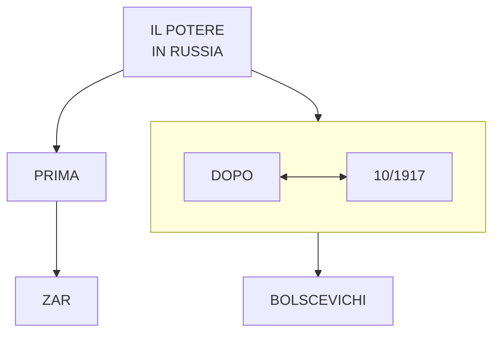

https://mermaid.live/edit#pako:eNpVkE1vwjAMhv9K5MNOhSVp148IITFAWiVYUbvtQLJDoIGi0RaFVhur-O_LShHCp7yvHzu2G1iXqQIGm335vc6krkSBTGAeztAiepvGUzRY6SEKX1H8niTh6LMDCF_E4fwmMV-O4k4d69VWy0OGMOUCkIDOb0mK-SRaRPcW5gQ_koB49zYa9HrDNn-xVZF2_1HCn6NZMp5-hOOX8DoFanGCHgxwHazz8LXwoikBC3Klc7lLzfrNf1ZAlalcCWDmmUr9JUAUZ8PJuiqTU7EGVulaWVAfUlmpyU6aLXNgG7k_Glelu6rU88s927NacJDFsixvjNHAGvgB1vPtoO97lPjY8QPbCWwLTsB8tx84ToB9iv0nz3XcswW_bQfa94hNKCXUANjGnmuBLutt1jU__wHJlHrW