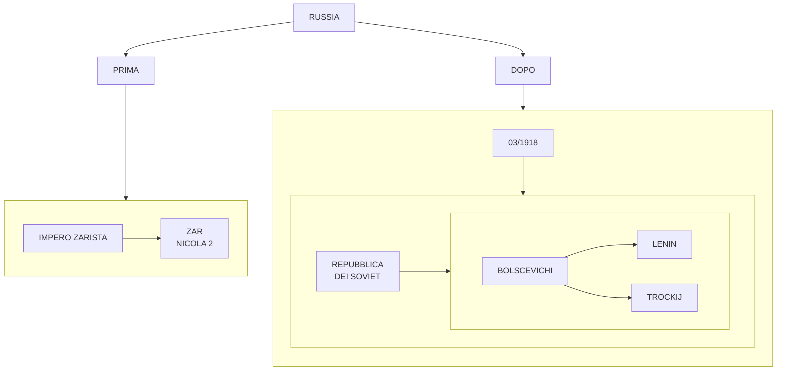
```mermaid
flowchart TB
    0[RUSSIA]
    01[PRIMA]
    subgraph 010[" "]
        0100[IMPERO ZARISTA]
        01000[ZAR<br>NICOLA 2]
        0100 --> 01000
    end
    02[DOPO]
    subgraph 020[" "]
        direction TB
        0200[03/1918]
        subgraph 022[" "]
            direction LR
            02000[REPUBBLICA <br> DEI SOVIET]
            subgraph 021[" "]
                0210[BOLSCEVICHI]
                02100[LENIN]
                02101[TROCKIJ]
                0210 --> 02100 & 02101
            end
            02000 --> 021
        end
        0200 --> 022
    end
    0 --> 01 & 02
    01 --> 010
    02 --> 020
```

----

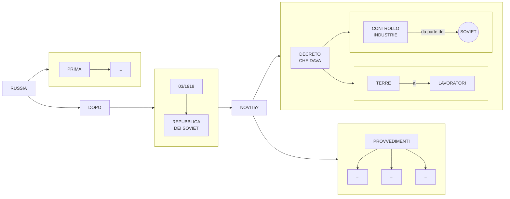
```mermaid
flowchart LR
    0[RUSSIA]
    subgraph 01[" "]
        direction LR
        010[PRIMA] -->
        0100[...]
    end
    02[DOPO]
    subgraph 020[" "]
        0200[03/1918] -->
        02000[REPUBBLICA <br> DEI SOVIET]
    end
    03[NOVITà?]
    subgraph 033[" "]
        direction LR
        030[DECRETO <br> CHE DAVA]
        subgraph 031[" "]
            direction LR
            0310[TERRE] --> |ai| 03100[LAVORATORI]
        end
        subgraph 032[" "]
            direction LR
            0320[CONTROLLO<br>INDUSTRIE]
            03200((SOVIET))
            0320 -->|da parte dei| 03200
        end
        030 --> 031 & 032
    end
    subgraph 036[" "]
        035[PROVVEDIMENTI]
        0350[...]
        0351[...]
        0352[...]
    end
    035 --> 0350 & 0351 & 0352;
    0 --> 01
    0 --> 02 --> 020
    020 --> 03 --> 033 & 036
```

----

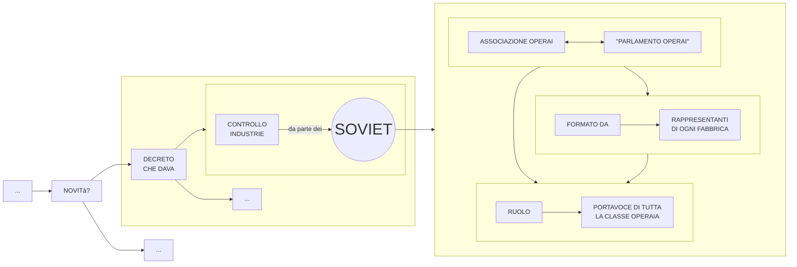
```mermaid
flowchart LR
    0[...] 
    01[NOVITà?]
    subgraph 013[" "]
        010[DECRETO <br> CHE DAVA]
        011[...]
        subgraph 012[" "]
            0120[CONTROLLO<br>INDUSTRIE]
            style 01200 font-size:40px;
            01200((SOVIET))
            0120 -->|da parte dei| 01200
        end
        010 --> 011 & 012
    end
    014[...]
    subgraph 05[" "]
        subgraph 02[" "]
            020[ASSOCIAZIONE OPERAI]
            021["''PARLAMENTO OPERAI''"]
            020 <-->021
        end
        subgraph 03[" "]
            030[FORMATO DA]
            0300[RAPPRESENTANTI <BR> DI OGNI FABBRICA]
            030 --> 0300
        end
        subgraph 04[" "]
            040[RUOLO]
            0400[PORTAVOCE DI TUTTA <BR> LA CLASSE OPERAIA]
            040 --> 0400
        end
    end
    02 --> 03 & 04
    03 --> 04
    01200 --> 05
    0 --> 01 --> 010 & 014
```

----

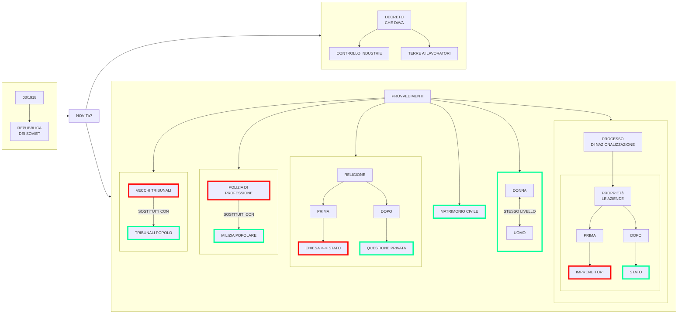
```mermaid
flowchart LR
    subgraph 0[" "]
        00[03/1918] -->
        000[REPUBBLICA <br> DEI SOVIET]
    end
    01[NOVITà?]
    subgraph 013[" "]
        direction TB;
        010[DECRETO <br> CHE DAVA]
        011[CONTROLLO INDUSTRIE]
        012[TERRE AI LAVORATORI]
        010 --> 011 & 012
    end
    subgraph 014[" "]
        1[PROVVEDIMENTI]
        subgraph 10[" "]
            100[VECCHI TRIBUNALI]
            style 100 stroke:#ff0000, stroke-width:5px;
            101[TRIBUNALI POPOLO]
            style 101 stroke:#00ff99, stroke-width:5px;
            100 -->|SOSTITUITI CON| 101
        end
        subgraph 11[" "]
            110[POLIZIA DI PROFESSIONE]
            style 110 stroke:#ff0000, stroke-width:5px;
            111[MILIZIA POPOLARE]
            style 111 stroke:#00ff99, stroke-width:5px;
            110 -->|SOSTITUITI CON| 111
        end
        subgraph 12[" "]
            120[RELIGIONE]
            1200[PRIMA]
            12000[CHIESA <--> STATO]
            style 12000 stroke:#ff0000, stroke-width:5px;
            1201[DOPO]
            12010[QUESTIONE PRIVATA]
            style 12010 stroke:#00ff99, stroke-width:5px;
            120 --> 1200 & 1201
            1201 --> 12010
            1200 --> 12000
        end
        13[MATRIMONIO CIVILE]
        style 13 stroke:#00ff99, stroke-width:5px;
        subgraph 14[" "]
            140[DONNA]
            141[UOMO]
            140 <-->|STESSO LIVELLO| 141
        end
        subgraph 15[" "]
            150[PROCESSO <br> DI NAZIONALIZZAZIONE]
            subgraph 151[" "]
                1510[PROPRIETà <BR> LE AZIENDE]
                15100[PRIMA]
                151000[IMPRENDITORI]
                style 151000 stroke:#ff0000, stroke-width:5px;
                15101[DOPO]
                151010[STATO]
                style 151010 stroke:#00ff99, stroke-width:5px;
                1510 --> 15100 & 15101
                15100 --> 151000
                15101 --> 151010
            end
            150 --> 1510
        end
        style 14 stroke:#00ff99, stroke-width:5px;
        1 --> 10 & 11 & 12 & 13 & 14 & 15
    end
    0 --> 01 --> 013 & 014
```

---

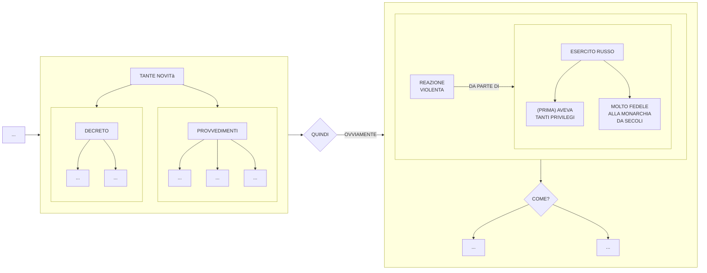
```mermaid
flowchart LR
    03[...]
    subgraph 0[" "]
        01[TANTE NOVITà]
        subgraph 010[" "]
            direction TB;
            0100[PROVVEDIMENTI]
            01000[...]
            01001[...]
            01002[...]
            0100 --> 01000 & 01001 & 01002
        end
        subgraph 011[" "]
            direction TB;
            0110[DECRETO]
            01100[...]
            01101[...]
            0110 --> 01100 & 01101
        end
        01 --> 010 & 011
    end
    02{QUINDI}
    03 --> 0 --> 02
    subgraph 022[" "]
        subgraph 020[" "]
            0200[REAZIONE <br> VIOLENTA]
            subgraph 021[" "]
                direction TB;
                0210[ESERCITO RUSSO]
                02100["(PRIMA) AVEVA <BR> TANTI PRIVILEGI"]
                02101[MOLTO FEDELE <BR> ALLA MONARCHIA <BR> DA SECOLI]
                0210 --> 02100 & 02101
            end
            0200 -->|DA PARTE DI| 021
        end
        04{COME?}
        040[...]
        041[...]
        04 --> 040 & 041
        020 --> 04  
    end
    02 -->|OVVIAMENTE| 022
```

----

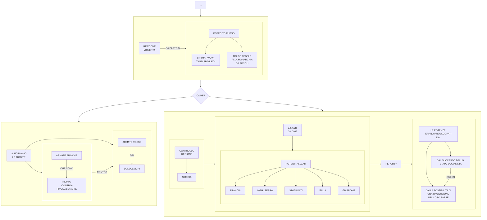
```mermaid
flowchart TB
    4[...]
    4 --> 020
    subgraph 020[" "]
        0200[REAZIONE <br> VIOLENTA]
        subgraph 021[" "]
            direction TB;
            0210[ESERCITO RUSSO]
            02100["(PRIMA) AVEVA <BR> TANTI PRIVILEGI"]
            02101[MOLTO FEDELE <BR> ALLA MONARCHIA <BR> DA SECOLI]
            0210 --> 02100 & 02101
        end
        0200 -->|DA PARTE DI| 021
    end
    04{COME?}
    04 --> 1 & 2
    020 --> 04  
    subgraph 1[" "]
        10[SI FORMANO <br> LE ARMATE]
        subgraph 100[" "]
            1000[ARMATE BIANCHE]
            10000[TRUPPE <BR> CONTRO-RIVOLUZIONARIE]
            1000 -->|CHE SONO| 10000
        end
        style 100 stroke:#FFFFFF, stroke-width:5px;
        subgraph 101[" "]
            1010[ARMATE ROSSE]
            10100[BOLSCEVICHI]
            1010 -->|DEI| 10100
        end
        10 --> 100 & 101
        100 --> |CONTRO| 101
    end
    subgraph 2[" "]
        subgraph 20[" "]
            200[CONTROLLO <br> REGIONE]
            2000[SIBERIA]
            200 --> 2000
        end
        subgraph 24[" "]
            21[AIUTATI <br> DA CHI?]
            subgraph 22[" "]
                23[POTENTI ALLEATI]
                230[FRANCIA]
                231[INGHILTERRA]
                232[STATI UNITI]
                233[ITALIA]
                234[GIAPPONE]
                23 --> 230 & 231 & 232 & 233 & 234
            end
        end
        26["PERCHè?"]
        subgraph 25[" "]
            250[LE POTENZE <BR> ERANO PREUCCOPATI DA:]
            2500[DAL SUCCESSO DELLO STATO SOCIALISTA]
            2501[DALLA POSSIBILITà DI <BR> UNA RIVOLUZIONE <BR> NEL LORO PAESE]
            250 --> 2500 & 2501
            2500 -->|QUINDI| 2501
        end
        20 --> 24
        21 --> 22
        24 --> 26 --> 25
    end
```

----

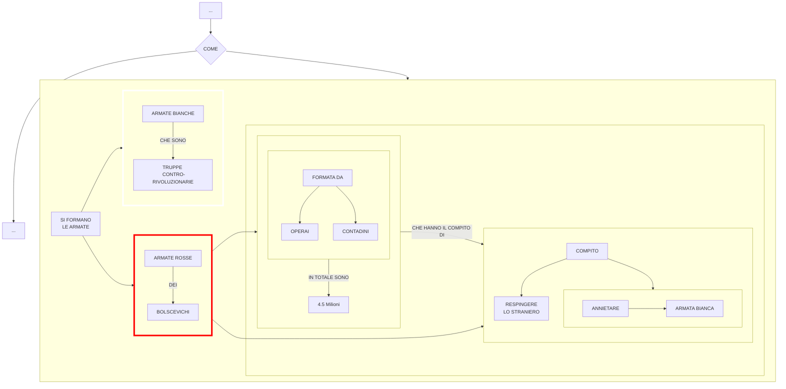
```mermaid
flowchart TB
    0[...]
    01{COME}
    02[...]
    subgraph 1[" "]
        10[SI FORMANO <br> LE ARMATE]
        subgraph 100[" "]
            1000[ARMATE BIANCHE]
            10000[TRUPPE <BR> CONTRO-RIVOLUZIONARIE]
            1000 -->|CHE SONO| 10000
        end
        style 100 stroke:#FFFFFF, stroke-width:5px;
        subgraph 101[" "]
            1010[ARMATE ROSSE]
            10100[BOLSCEVICHI]
            1010 -->|DEI| 10100
        end
        subgraph 2[" "]
            style 101 stroke:#FF0000, stroke-width:5px;
            subgraph 41[" "]
                subgraph 4[" "]
                    40[FORMATA DA]
                    400[OPERAI]
                    401[CONTADINI]
                    40 --> 400 & 401
                end
                410[4.5 Milioni]
                4 -->|IN TOTALE SONO| 410
            end
            subgraph 42[" "]
                420[COMPITO]
                4200[RESPINGERE <br> LO STRANIERO]
                subgraph 4201[" "]
                    42010[ANNIETARE]
                    42011[ARMATA BIANCA]
                    42010 --> 42011
                end
                420 --> 4200 & 4201
            end
            41 -->|CHE HANNO IL COMPITO DI| 42
        end
    end
    101 --> 41 & 42
    10 --> 100 & 101
    0 --> 01
    01 --> 1 & 02
```

----

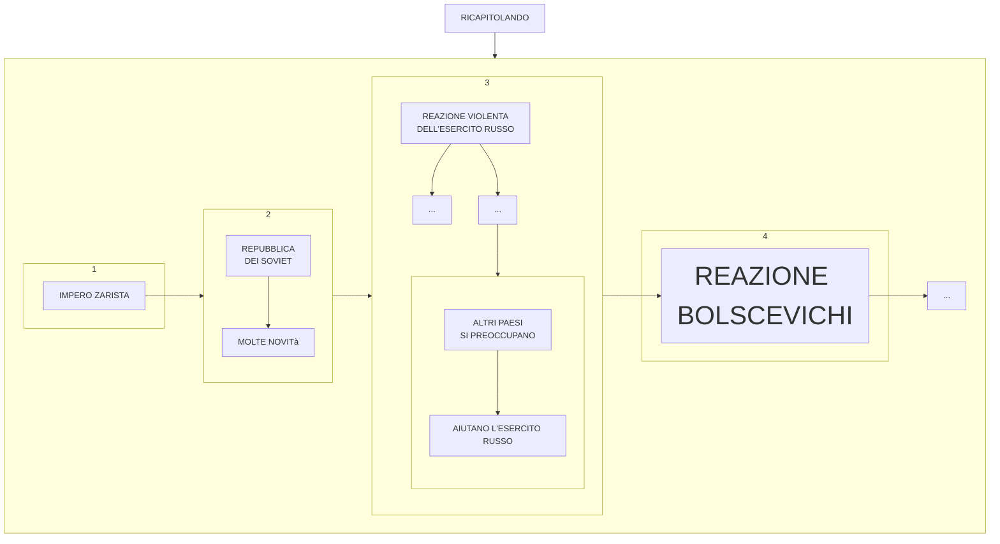
```mermaid
flowchart TB
    0[RICAPITOLANDO]
    subgraph 1[" "]
        subgraph 2["1"]
            01[IMPERO ZARISTA]
        end
        subgraph 02["2"]
            020[REPUBBLICA <br> DEI SOVIET]
            021[MOLTE NOVITà]
            020 --> 021
        end
        subgraph 03["3"]
            030[REAZIONE VIOLENTA <br> DELL'ESERCITO RUSSO]
            031[...]
            032[...]
            subgraph 033[" "]
                0330[ALTRI PAESI <BR> SI PREOCCUPANO]
                03300[AIUTANO L'ESERCITO RUSSO]
                0330 --> 03300
            end
            030 --> 031 & 032
            032 --> 033
        end
        subgraph 3["4"]
            04[REAZIONE BOLSCEVICHI]
            style 04 font-size:50px;
        end
        05[...]
        01 --> 02 --> 03 --> 04 --> 05
    end
    0 --> 1
```

----

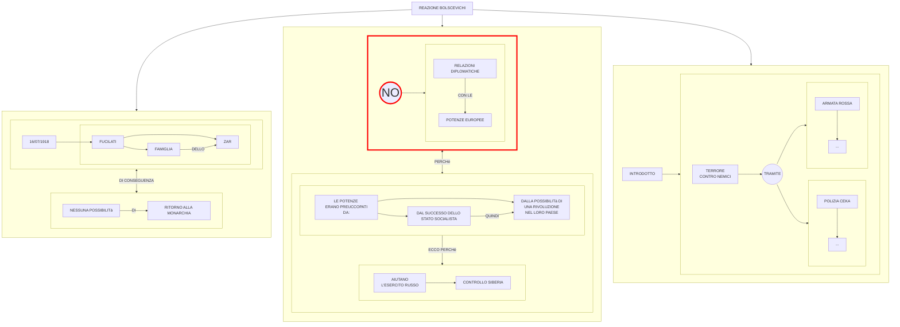
```mermaid
flowchart TB
    0[REAZIONE BOLSCEVICHI]
    subgraph 13[" "]
        direction TB;
        subgraph 1[" "]
            10[16/07/1918]
            subgraph 11[" "]
                110[FUCILATI]
                1100[ZAR]
                1101[FAMIGLIA]
                110 --> 1100 & 1101
                1101 -->|DELLO| 1100
            end
            10 --> 110
        end
        subgraph 12[" "]
            120[NESSUNA POSSIBILITà]
            121[RITORNO ALLA MONARCHIA]
            120 --> |DI| 121
        end
        1 <-->|DI CONSEGUENZA| 12 
    end
    subgraph 2[" "]
        direction TB;
        subgraph 20[" "]
            200((NO))
            style 200 stroke:#ff0000, stroke-width:5px, font-size:50px;
            subgraph 21[" "]
                210[RELAZIONI DIPLOMATICHE]
                211[POTENZE EUROPEE]
                210 -->|CON LE| 211
            end
            200 --> 21
        end
        style 20 stroke:#ff0000, stroke-width:5px;
        subgraph 27[" "]
            direction TB;
            subgraph 25[" "]
                250[LE POTENZE <BR> ERANO PREUCCOPATI DA:]
                2500[DAL SUCCESSO DELLO STATO SOCIALISTA]
                2501[DALLA POSSIBILITà DI <BR> UNA RIVOLUZIONE <BR> NEL LORO PAESE]
                250 --> 2500 & 2501
                2500 -->|QUINDI| 2501
            end
            subgraph 28[" "]
                280[AIUTANO <br> L'ESERCITO RUSSO]
                281[CONTROLLO SIBERIA]
                280 --> 281
            end
            25 -->|ECCO PERCHè| 28
        end
        20 <-->|PERCHè| 27
    end
    subgraph 3[" "]
        30[INTRODOTTO]
        subgraph 31[" "]
            direction LR;
            310[TERRORE <BR> CONTRO NEMICI]
            311((TRAMITE))
            subgraph 314[" "]
                312[ARMATA ROSSA]
                3120[...]
                312 --> 3120
            end
            subgraph 315[" "]
                313[POLIZIA CEKA]
                3130[...]
                313 --> 3130
            end
            310 --> 311 --> 314 & 315
        end
        30 --> 31
    end
    0 --> 13 & 2 & 3
```

----

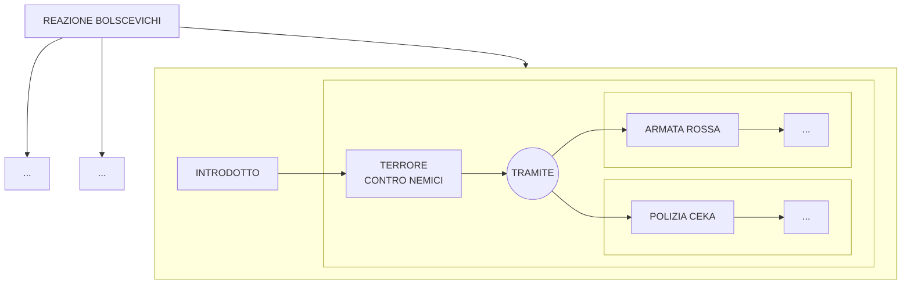
```mermaid
flowchart TB
    0[REAZIONE BOLSCEVICHI]
    1[...]
    2[...]
    subgraph 3[" "]
        30[INTRODOTTO]
        subgraph 31[" "]
            direction LR;
            310[TERRORE <BR> CONTRO NEMICI]
            311((TRAMITE))
            subgraph 3110[" "]
                312[ARMATA ROSSA]
                3120[...]
                312 --> 3120
            end
            subgraph 3111[" "]
                313[POLIZIA CEKA]
                3130[...]
                313 --> 3130
            end
        end
        30 --> 310 --> 311 --> 312 & 313
    end
    0 --> 1 & 2 & 3
```

----

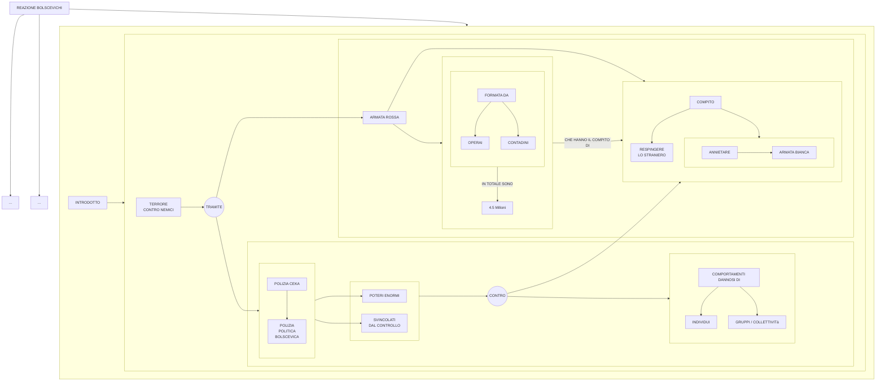
```mermaid
flowchart TB
    0[REAZIONE BOLSCEVICHI]
    1[...]
    2[...]
    subgraph 3[" "]
        30[INTRODOTTO]
        subgraph 31[" "]
            direction LR;
            310[TERRORE <BR> CONTRO NEMICI]
            311((TRAMITE))
            subgraph 314[" "]
                312[ARMATA ROSSA]
                subgraph 41[" "]
                    subgraph 4[" "]
                        40[FORMATA DA]
                        400[OPERAI]
                        401[CONTADINI]
                        40 --> 400 & 401
                    end
                    410[4.5 Milioni]
                    4 -->|IN TOTALE SONO| 410
                end
                subgraph 42[" "]
                    420[COMPITO]
                    4200[RESPINGERE <br> LO STRANIERO]
                    subgraph 4201[" "]
                        42010[ANNIETARE]
                        42011[ARMATA BIANCA]
                        42010 --> 42011
                    end
                    420 --> 4200 & 4201
                end
                312 --> 41 & 42
                41 -->|CHE HANNO IL COMPITO DI| 42
            end
            subgraph 315[" "]
                subgraph 3150[" "]
                    313[POLIZIA CEKA]
                    3130[POLIZIA <br> POLITICA <br> BOLSCEVICA]
                    313 --> 3130
                end
                subgraph 5[" "]
                    50[POTERI ENORMI]
                    51[SVINCOLATI <br> DAL CONTROLLO]
                end
                3150 --> 50 & 51
                5 --> 6
                6((CONTRO))
                subgraph 60[" "]
                    600[COMPORTAMENTI DANNOSI DI]
                    601[INDIVIDUI]
                    602[GRUPPI / COLLETTIVITà]
                    600 --> 601 & 602
                end
                6 --> 60 & 42
            end
            310 --> 311 --> 312 & 3150
        end
        30 --> 31
    end
    0 --> 1 & 2 & 3
```

----

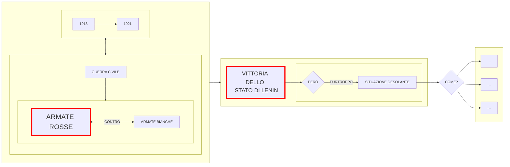
```mermaid
flowchart LR;
    subgraph 0[" "]
        direction TB;
        subgraph 01[" "]
            direction LR;
            010[1918]
            011[1921]
            010 --> 011
        end
        01 <--> 02

        subgraph 02[" "]
            direction TB;
            020[GUERRA CIVILE]
            subgraph 021[" "]
                direction LR;
                0210[ARMATE ROSSE]
                style 0210 stroke:#ff0000,stroke-width:5px, font-size:30px;
                0211[ARMATE BIANCHE]
                0210 <-->|CONTRO| 0211
            end
            020 --> 021
        end
    end

    subgraph 3[" "]
        1[VITTORIA DELLO <BR> STATO DI LENIN]
        style 1 stroke:#ff0000,stroke-width:5px, font-size:25px;
        subgraph 30[" "]
            2{PERÒ}
            20[SITUAZIONE DESOLANTE]
        end
        1 --> 2 -->|PURTROPPO| 20
    end
    0 --> 3

    4{COME?}
    20 --> 4
    subgraph 5[" "]
        50[...]
        51[...]
        53[...]
    end
    4 --> 50 & 51 & 53
```

----

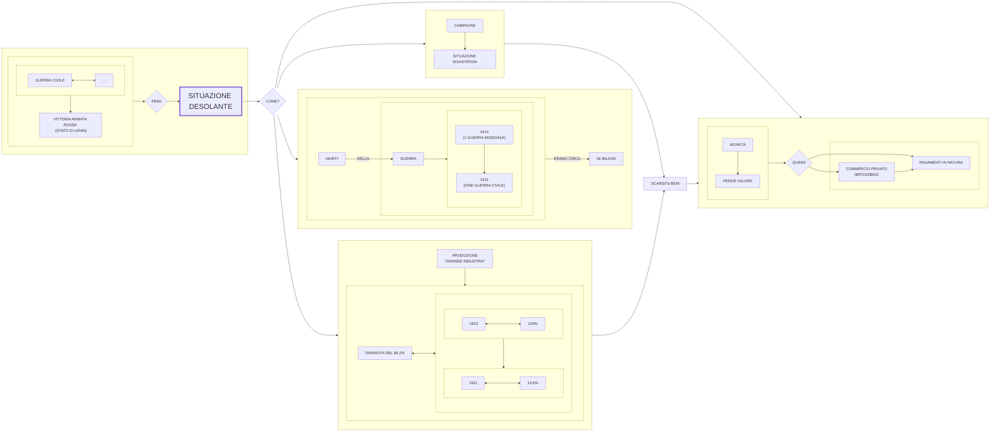
```mermaid
flowchart LR
    classDef classGrande font-size: 30px, stroke-width: 5px;
    subgraph 017[" "]
      subgraph 016[" "]
        subgraph 01[" "]
          010[GUERRA CIVILE]
          0100[...]
          010 <--> 0100
        end
        011["VITTORIA ARMATA ROSSA <br> (STATO DI LENIN)"]
        01 --> 011
      end
      016 --> 012 --> 013
      012{PERò}
      013[SITUAZIONE DESOLANTE]:::classGrande
    end
    013 --> 014
    %%    017 --> 014
    014{COME?}
    subgraph 2[" "]
      20[PRODUZIONE <br> ''GRANDE INDUSTRIA'']
      subgraph 21[" "]
        200[DIMINUITA DEL 86,2%]
        subgraph 210[" "]
          direction TB;
          subgraph 22[" "]
            direction LR;
            220[1913]
            221[100%]
            220 <-->221
          end
          subgraph 23[" "]
            direction LR;
            230[1921]
            231[13,8%]
            230 <--> 231
          end
          22 --> 23
        end
        200 <--> 210
      end
      20 --> 21
    end
    014 --> 2
    subgraph 3[" "]
      30[CAMPAGNE]
      31[SITUAZIONE DISASTROSA]
      30 --> 31
    end
    014 --> 3
    4[SCARSITà BENI]
    3 & 2 --> 4
    subgraph 5[" "]
      direction LR
      subgraph 50[" "]
        500[MONETA]
        501[PERDE VALORE]
        500 --> 501
      end
      51{QUINDI}
      subgraph 54[" "]
        52[PAGAMENTI IN NATURA]
        53[COMMERCIO PRIVATO <br> IMPOSSIBILE]
      end
      50 --> 51 --> 52 & 53
      53 --> 52
    end
    014 --> 5
    subgraph 6[" "]
      direction LR;
      subgraph 7[" "]
        direction LR;
        70[MORTI]
        subgraph 8[" "]
          direction TB;
          80[GUERRA]
          subgraph 9[" "]
            direction TB;
            90["1914 <br> (1 GUERRA MONDIALE)"]
            91["1921 <BR> (FINE GUERRA CIVILE)"]
          end
        end
      end
      60[28 MILIONI]
      70 -->|DELLA| 80
      80 --> 9
      90 --> 91
      7 -->|ERANO CIRCA| 60
    end
    4 --> 5
    014 --> 6
```

