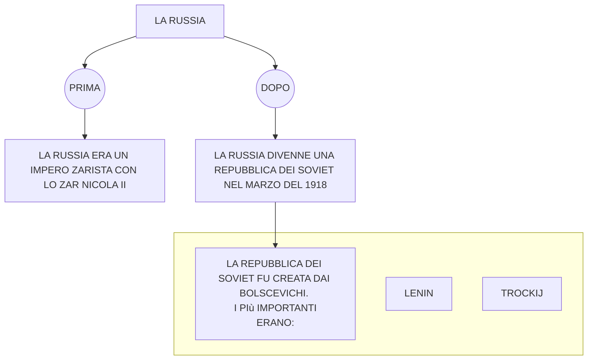

```mermaid
flowchart TB
  0[LA RUSSIA]
  01((PRIMA))
  02((DOPO))
  1[LA RUSSIA ERA UN IMPERO ZARISTA CON LO ZAR NICOLA II]
  2[LA RUSSIA DIVENNE UNA REPUBBLICA DEI SOVIET NEL MARZO DEL 1918]
  0 --> 01 & 02 
  01 --> 1 
  02 --> 2
  subgraph 30[" "]
    20[LA REPUBBLICA DEI SOVIET FU CREATA DAI BOLSCEVICHI. <br> I PIù IMPORTANTI ERANO:]
    200[LENIN]
    201[TROCKIJ]
  end
  2 --> 20
```