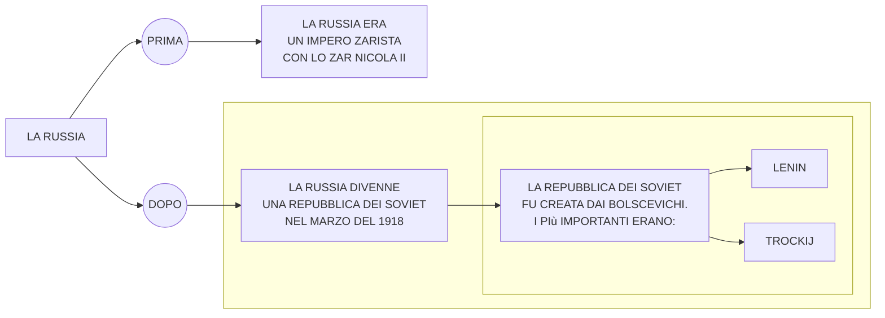
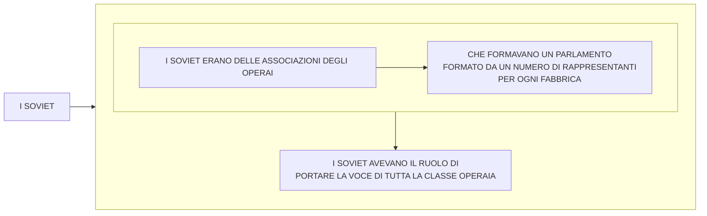
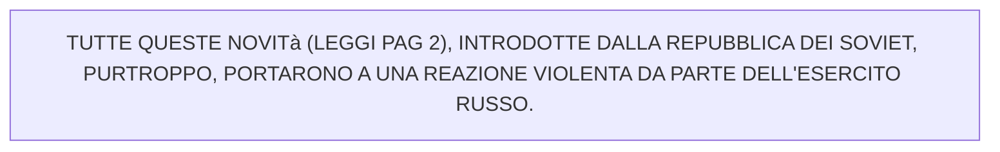

```mermaid
%%{init: { "flowchart": { "wrappingWidth": 300 } }}%%
flowchart LR
  0[LA RUSSIA]
  01((PRIMA))
  02((DOPO))
  1[LA RUSSIA ERA <br> UN IMPERO ZARISTA <br> CON LO ZAR NICOLA II]
  0 --> 01 & 02 
  01 --> 1 
  02 --> 2
  subgraph 40[" "]
    2[LA RUSSIA DIVENNE <br> UNA REPUBBLICA DEI SOVIET <br> NEL MARZO DEL 1918]:::wide
    subgraph 30[" "]
      20[LA REPUBBLICA DEI SOVIET <br> FU CREATA DAI BOLSCEVICHI. <br> I PIù IMPORTANTI ERANO:]
      200[LENIN]
      201[TROCKIJ]
      20 --> 200 & 201
    end
  end
  2 --> 20
```

----

```mermaid
%%{init: { "flowchart": { "wrappingWidth": 400 } }}%%
flowchart LR
  0[LA REPUBBLICA DEI SOVIET <br> INTRODUSSE DIVERSE NOVITà <br> ATTRAVERSO UN DECRETO E DEI PROVVEDIMENTI]
  1[IL DECRETO DAVA <br>DELLE TERRE AI LAVORATORI <br> E AI SOVIET IL CONTROLLO DELLE INDUSTRIE]
  subgraph 20[" "]
    2[I PROVVEDIMENTI FURONO:]
    30[I VECCHI TRIBUNALI FURONO <br>SOSTITUITI DAI TRIBUNALI DEL POPOLO]
    31[LA POLIZIA DI PROFESSIONE <br>VENNE SOSTITUITA CON LA MILIZIA POPOLARE]
    32[LA RELIGIONE DIVENTò UNA QUESTIONE PRIVATA, <br>DI CONSEGUENZA NON PIù DI STATO]
    33[SI INTRODUSSE IL CONCETTO <br>DI MATRIMONIO CIVILE]
    34[PARITà TRA UOMO E DONNA]
    35[SI ATTUò UN PROCESSO DI NAZIONALIZZAZIONE <br>CHE CONSISTEVA NEL PASSAGGIO DELLA PROPRIETà DELLE AZIENDE ALLO STATO. <br><br>QUESTE AZIENDE PRIMA ERANO DI PROPRIETà <br> DEGLI IMPRENDITORI]
    2 --> 30 & 31 & 32 & 33 & 34 & 35
  end
  0 --> 1 & 2
```

----

```mermaid
%%{init: { "flowchart": { "wrappingWidth": 400 } }}%%
flowchart LR
  0[I SOVIET]
  subgraph 4[" "]
    subgraph 2[" "]
      direction LR
      1[I SOVIET ERANO DELLE ASSOCIAZIONI DEGLI OPERAI]
      10[CHE FORMAVANO UN PARLAMENTO <br>FORMATO DA UN NUMERO DI RAPPRESENTANTI <br>PER OGNI FABBRICA]
      1 --> 10
    end
    3[I SOVIET AVEVANO IL RUOLO DI <BR> PORTARE LA VOCE DI TUTTA LA CLASSE OPERAIA]
    2 --> 3
  end
  0 --> 4
```

----

```mermaid
%%{init: { "flowchart": { "wrappingWidth": 700 } }}%%
flowchart LR
  0["TUTTE QUESTE NOVITà (LEGGI PAG 2), INTRODOTTE DALLA REPUBBLICA DEI SOVIET, <br>PURTROPPO, PORTARONO A UNA REAZIONE VIOLENTA DA PARTE DELL'ESERCITO RUSSO."]
```
