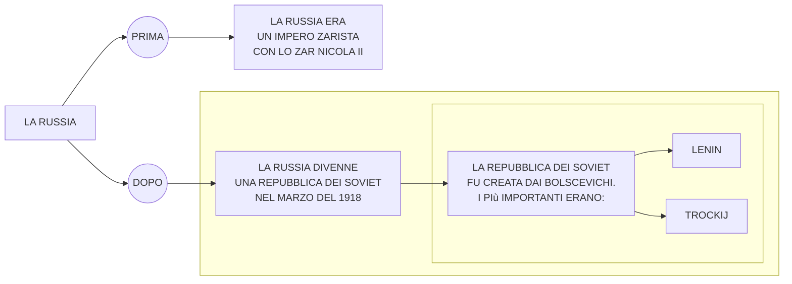
```mermaid
%%{init: { "flowchart": { "wrappingWidth": 300 } }}%%
flowchart LR
  0[LA RUSSIA]
  01((PRIMA))
  02((DOPO))
  1[LA RUSSIA ERA <br> UN IMPERO ZARISTA <br> CON LO ZAR NICOLA II]
  0 --> 01 & 02 
  01 --> 1 
  02 --> 2
  subgraph 40[" "]
    2[LA RUSSIA DIVENNE <br> UNA REPUBBLICA DEI SOVIET <br> NEL MARZO DEL 1918]:::wide
    subgraph 30[" "]
      20[LA REPUBBLICA DEI SOVIET <br> FU CREATA DAI BOLSCEVICHI. <br> I PIù IMPORTANTI ERANO:]
      200[LENIN]
      201[TROCKIJ]
      20 --> 200 & 201
    end
  end
  2 --> 20
```

----

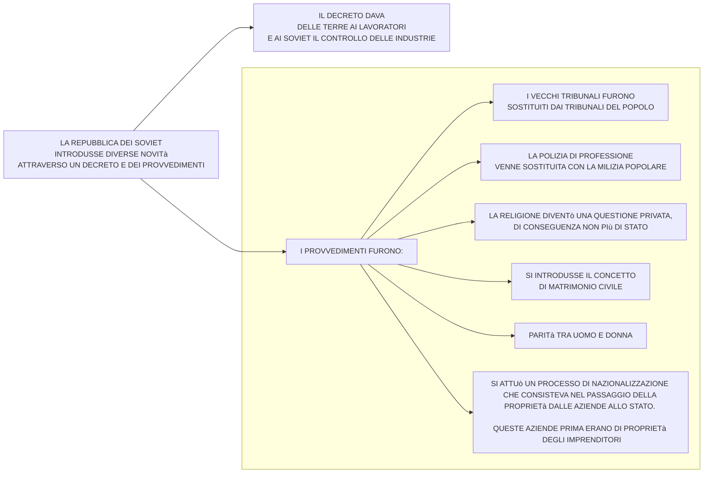
```mermaid
%%{init: { "flowchart": { "wrappingWidth": 400 } }}%%
flowchart LR
  0[LA REPUBBLICA DEI SOVIET <br> INTRODUSSE DIVERSE NOVITà <br> ATTRAVERSO UN DECRETO E DEI PROVVEDIMENTI]
  1[IL DECRETO DAVA <br>DELLE TERRE AI LAVORATORI <br> E AI SOVIET IL CONTROLLO DELLE INDUSTRIE]
  subgraph 20[" "]
    2[I PROVVEDIMENTI FURONO:]
    30[I VECCHI TRIBUNALI FURONO <br>SOSTITUITI DAI TRIBUNALI DEL POPOLO]
    31[LA POLIZIA DI PROFESSIONE <br>VENNE SOSTITUITA CON LA MILIZIA POPOLARE]
    32[LA RELIGIONE DIVENTò UNA QUESTIONE PRIVATA, <br>DI CONSEGUENZA NON PIù DI STATO]
    33[SI INTRODUSSE IL CONCETTO <br>DI MATRIMONIO CIVILE]
    34[PARITà TRA UOMO E DONNA]
    35[SI ATTUò UN PROCESSO DI NAZIONALIZZAZIONE <br>CHE CONSISTEVA NEL PASSAGGIO DELLA PROPRIETà DALLE AZIENDE ALLO STATO. <br><br>QUESTE AZIENDE PRIMA ERANO DI PROPRIETà <br> DEGLI IMPRENDITORI]
    2 --> 30 & 31 & 32 & 33 & 34 & 35
  end
  0 --> 1 & 2
```

----

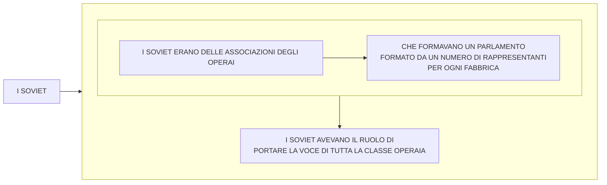
```mermaid
%%{init: { "flowchart": { "wrappingWidth": 400 } }}%%
flowchart LR
  0[I SOVIET]
  subgraph 4[" "]
    subgraph 2[" "]
      direction LR
      1[I SOVIET ERANO DELLE ASSOCIAZIONI DEGLI OPERAI]
      10[CHE FORMAVANO UN PARLAMENTO <br>FORMATO DA UN NUMERO DI RAPPRESENTANTI <br>PER OGNI FABBRICA]
      1 --> 10
    end
    3[I SOVIET AVEVANO IL RUOLO DI <BR> PORTARE LA VOCE DI TUTTA LA CLASSE OPERAIA]
    2 --> 3
  end
  0 --> 4
```

----

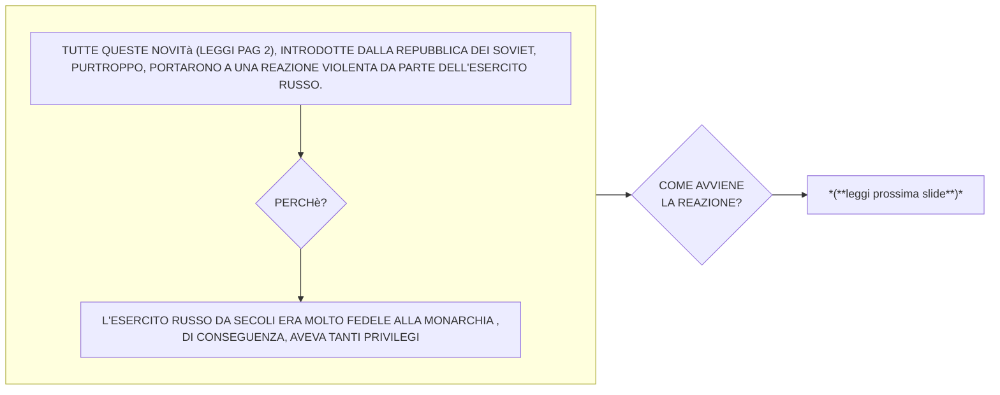
```mermaid
%%{init: { "flowchart": { "wrappingWidth": 700 } }}%%
flowchart LR
  subgraph 3[" "]
    direction TB
    0["TUTTE QUESTE NOVITà (LEGGI PAG 2), INTRODOTTE DALLA REPUBBLICA DEI SOVIET, <br>PURTROPPO, PORTARONO A UNA REAZIONE VIOLENTA DA PARTE DELL'ESERCITO RUSSO."]
    1{PERCHè?}
    2[L'ESERCITO RUSSO DA SECOLI ERA MOLTO FEDELE ALLA MONARCHIA , <br> DI CONSEGUENZA, AVEVA TANTI PRIVILEGI]
    0 --> 1 --> 2
  end
  4{COME AVVIENE <br>LA REAZIONE?}
  3 --> 4
  40["*(**leggi prossima slide**)*"]
  4 --> 40
```

----

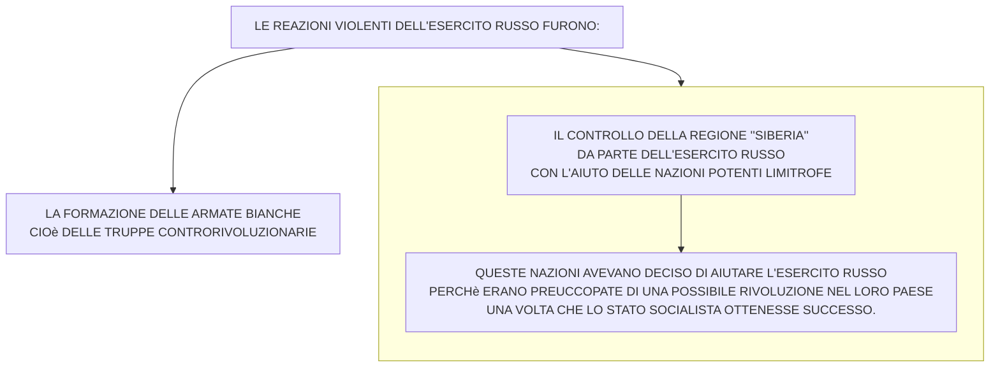
```mermaid
%%{init: { "flowchart": { "wrappingWidth": 700 } }}%%
flowchart TB
  0[LE REAZIONI VIOLENTI DELL'ESERCITO RUSSO FURONO:]
  1[LA FORMAZIONE DELLE ARMATE BIANCHE <br> CIOè DELLE TRUPPE CONTRORIVOLUZIONARIE]
  subgraph 02[" "]
    direction TB
    2[IL CONTROLLO DELLA REGIONE ''SIBERIA'' <BR>DA PARTE DELL'ESERCITO RUSSO <BR>CON L'AIUTO DELLE NAZIONI POTENTI LIMITROFE]
    20[QUESTE NAZIONI AVEVANO DECISO DI AIUTARE L'ESERCITO RUSSO <BR>PERCHè ERANO PREUCCOPATE DI UNA POSSIBILE RIVOLUZIONE NEL LORO PAESE <BR>UNA VOLTA CHE LO STATO SOCIALISTA OTTENESSE SUCCESSO.]
    2 --> 20
  end
  0 --> 1 & 02
```

---

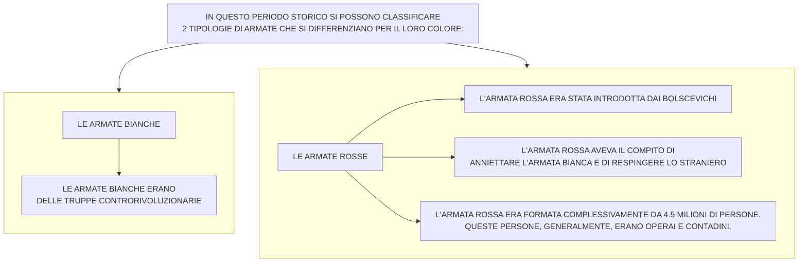
```mermaid
%%{init: { "flowchart": { "wrappingWidth": 700 } }}%%
flowchart TB
  0[IN QUESTO PERIODO STORICO SI POSSONO CLASSIFICARE <br>2 TIPOLOGIE DI ARMATE CHE SI DIFFERENZIANO PER IL LORO COLORE:]
  subgraph 1[" "]
    direction TB;
    10[LE ARMATE BIANCHE]
    100[LE ARMATE BIANCHE ERANO <br>DELLE TRUPPE CONTRORIVOLUZIONARIE]
    10 --> 100
  end
  subgraph 2[" "]
    11[LE ARMATE ROSSE]
    110[L'ARMATA ROSSA ERA STATA INTRODOTTA DAI BOLSCEVICHI]
    111[L'ARMATA ROSSA AVEVA IL COMPITO DI <br>ANNIETTARE L'ARMATA BIANCA E DI RESPINGERE LO STRANIERO]
    112[L'ARMATA ROSSA ERA FORMATA COMPLESSIVAMENTE DA 4.5 MILIONI DI PERSONE. <br> QUESTE PERSONE, GENERALMENTE, ERANO OPERAI E CONTADINI.]
    11 --> 110 & 111 & 112
  end
  0 --> 1 & 2
```

----

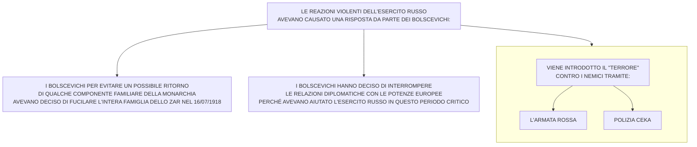
```mermaid
%%{init: { "flowchart": { "wrappingWidth": 800 } }}%%
flowchart TB
  0[LE REAZIONI VIOLENTI DELL'ESERCITO RUSSO <br>AVEVANO CAUSATO UNA RISPOSTA DA PARTE DEI BOLSCEVICHI:]
  1[I BOLSCEVICHI PER EVITARE UN POSSIBILE RITORNO <BR>DI QUALCHE COMPONENTE FAMILIARE DELLA MONARCHIA <BR> AVEVANO DECISO DI FUCILARE L'INTERA FAMIGLIA DELLO ZAR NEL 16/07/1918]
  2[I BOLSCEVICHI HANNO DECISO DI INTERROMPERE <br>LE RELAZIONI DIPLOMATICHE CON LE POTENZE EUROPEE <br> PERCHÉ AVEVANO AIUTATO L'ESERCITO RUSSO IN QUESTO PERIODO CRITICO]
  subgraph 30[" "]
    direction TB
    3[VIENE INTRODOTTO IL ''TERRORE'' <BR> CONTRO I NEMICI TRAMITE:]
    4[L'ARMATA ROSSA]
    5[POLIZIA CEKA]
    3 --> 4 & 5
  end
  0 --> 1 & 2 & 30
```

----

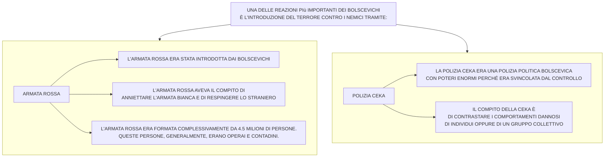
```mermaid
%%{init: { "flowchart": { "wrappingWidth": 800 } }}%%
flowchart TB
  0[UNA DELLE REAZIONI PIù IMPORTANTI DEI BOLSCEVICHI <br> È L'INTRODUZIONE DEL TERRORE CONTRO I NEMICI TRAMITE:]
  subgraph 1[" "]
    10[ARMATA ROSSA]
    11[L'ARMATA ROSSA ERA STATA INTRODOTTA DAI BOLSCEVICHI]
    12[L'ARMATA ROSSA AVEVA IL COMPITO DI <br>ANNIETTARE L'ARMATA BIANCA E DI RESPINGERE LO STRANIERO]
    13[L'ARMATA ROSSA ERA FORMATA COMPLESSIVAMENTE DA 4.5 MILIONI DI PERSONE. <br> QUESTE PERSONE, GENERALMENTE, ERANO OPERAI E CONTADINI.]
    10 --> 11 & 12 & 13
  end
  subgraph 2[" "]
    20 --> 21 & 22
    20[POLIZIA CEKA]
    21[LA POLIZIA CEKA ERA UNA POLIZIA POLITICA BOLSCEVICA <br>CON POTERI ENORMI PERCHÉ ERA SVINCOLATA DAL CONTROLLO]
    22[IL COMPITO DELLA CEKA È <br>DI CONTRASTARE I COMPORTAMENTI DANNOSI <br> DI INDIVIDUI OPPURE DI UN GRUPPO COLLETTIVO]
  end
  0 --> 1 & 2
```

----

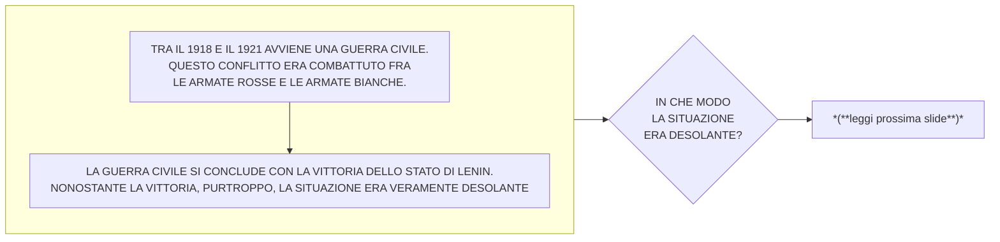
```mermaid
%%{init: { "flowchart": { "wrappingWidth": 800 } }}%%
flowchart LR
  subgraph 3[" "]
    0[TRA IL 1918 E IL 1921 AVVIENE UNA GUERRA CIVILE. <br> QUESTO CONFLITTO ERA COMBATTUTO FRA <br> LE ARMATE ROSSE E LE ARMATE BIANCHE.]
    1[LA GUERRA CIVILE SI CONCLUDE CON LA VITTORIA DELLO STATO DI LENIN. <br>NONOSTANTE LA VITTORIA, PURTROPPO, LA SITUAZIONE ERA VERAMENTE DESOLANTE]
    0 --> 1
  end
  2{IN CHE MODO <br>LA SITUAZIONE <br>ERA DESOLANTE?}
  20["*(**leggi prossima slide**)*"]
  2 --> 20
  3 --> 2
```

----

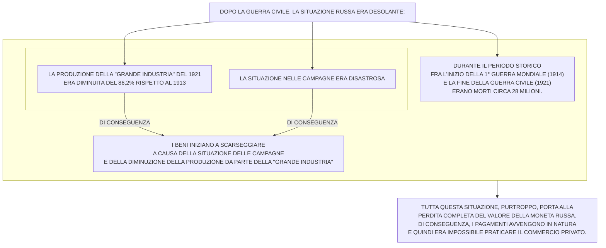
```mermaid
%%{init: { "flowchart": { "wrappingWidth": 800 } }}%%
flowchart TB
  0[DOPO LA GUERRA CIVILE, LA SITUAZIONE RUSSA ERA DESOLANTE:]
  subgraph 6[" "]
    1["DURANTE IL PERIODO STORICO <br> FRA L'INIZIO DELLA 1° GUERRA MONDIALE (1914) <br>E LA FINE DELLA GUERRA CIVILE (1921) <br> ERANO MORTI CIRCA 28 MILIONI."]
    subgraph 4[" "]
      2[LA PRODUZIONE DELLA ''GRANDE INDUSTRIA'' DEL 1921 <br>ERA DIMINUITA DEL 86,2% RISPETTO AL 1913]
      3[LA SITUAZIONE NELLE CAMPAGNE ERA DISASTROSA]
    end
    5[I BENI INIZIANO A SCARSEGGIARE <BR> A CAUSA DELLA SITUAZIONE DELLE CAMPAGNE <BR>E DELLA DIMINUZIONE DELLA PRODUZIONE DA PARTE DELLA ''GRANDE INDUSTRIA'']
  end
  0 --> 1 & 2 & 3
  2 & 3 -->|DI CONSEGUENZA| 5
  7[TUTTA QUESTA SITUAZIONE, PURTROPPO, PORTA ALLA <BR> PERDITA COMPLETA DEL VALORE DELLA MONETA RUSSA. <BR>DI CONSEGUENZA, I PAGAMENTI AVVENGONO IN NATURA <BR> E QUINDI ERA IMPOSSIBILE PRATICARE IL COMMERCIO PRIVATO.]
  6 ---> 7
```

----

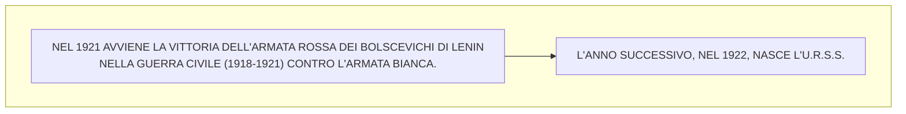
```mermaid
%%{init: { "flowchart": { "wrappingWidth": 800 } }}%%
flowchart TB
  subgraph 1[" "]
    0["NEL 1921 AVVIENE LA VITTORIA DELL'ARMATA ROSSA DEI BOLSCEVICHI DI LENIN <br>NELLA GUERRA CIVILE (1918-1921) CONTRO L'ARMATA BIANCA."]
    01["L'ANNO SUCCESSIVO, NEL 1922, NASCE L'U.R.S.S."]
    0 --> 01
  end
```

