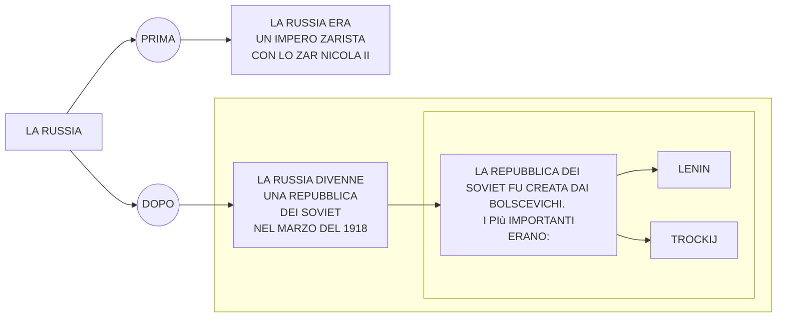

```mermaid
flowchart LR
  0[LA RUSSIA]
  01((PRIMA))
  02((DOPO))
  1[LA RUSSIA ERA <br> UN IMPERO ZARISTA <br> CON LO ZAR NICOLA II]
  0 --> 01 & 02 
  01 --> 1 
  02 --> 2
  subgraph 40[" "]
    2[LA RUSSIA DIVENNE <br> UNA REPUBBLICA <br> DEI SOVIET <br> NEL MARZO DEL 1918]
    subgraph 30[" "]
      20[LA REPUBBLICA DEI SOVIET FU CREATA DAI BOLSCEVICHI. <br> I PIù IMPORTANTI ERANO:]
      200[LENIN]
      201[TROCKIJ]
      20 --> 200 & 201
    end
  end
  2 --> 20
```