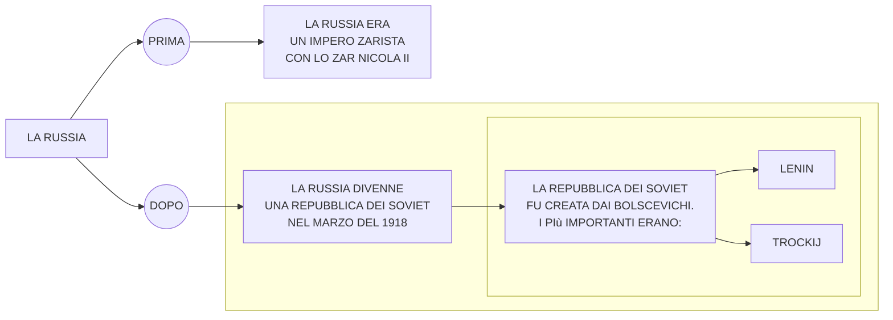
```mermaid
%%{init: { "flowchart": { "wrappingWidth": 300 } }}%%
flowchart LR
  0[LA RUSSIA]
  01((PRIMA))
  02((DOPO))
  1[LA RUSSIA ERA <br> UN IMPERO ZARISTA <br> CON LO ZAR NICOLA II]
  0 --> 01 & 02 
  01 --> 1 
  02 --> 2
  subgraph 40[" "]
    2[LA RUSSIA DIVENNE <br> UNA REPUBBLICA DEI SOVIET <br> NEL MARZO DEL 1918]:::wide
    subgraph 30[" "]
      20[LA REPUBBLICA DEI SOVIET <br> FU CREATA DAI BOLSCEVICHI. <br> I PIù IMPORTANTI ERANO:]
      200[LENIN]
      201[TROCKIJ]
      20 --> 200 & 201
    end
  end
  2 --> 20
```

----

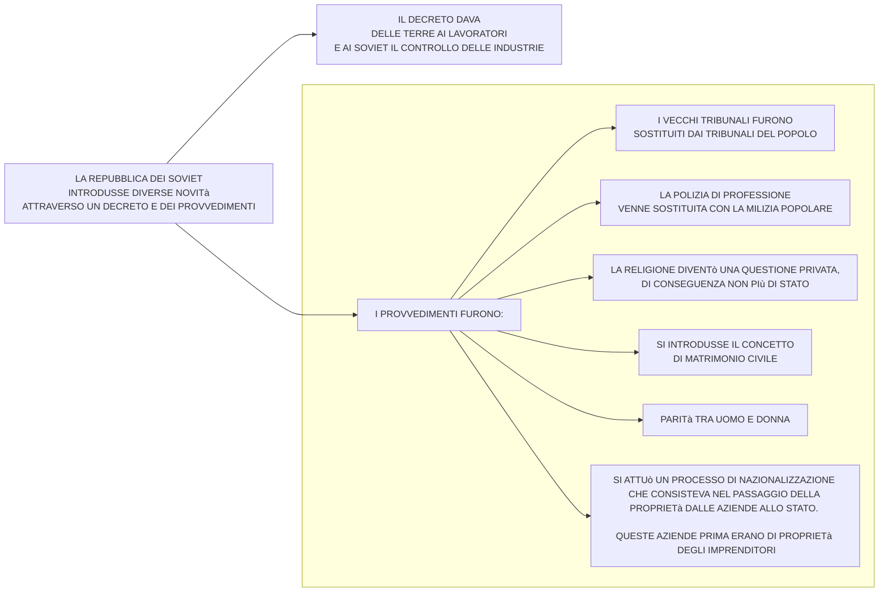
```mermaid
%%{init: { "flowchart": { "wrappingWidth": 400 } }}%%
flowchart LR
  0[LA REPUBBLICA DEI SOVIET <br> INTRODUSSE DIVERSE NOVITà <br> ATTRAVERSO UN DECRETO E DEI PROVVEDIMENTI]
  1[IL DECRETO DAVA <br>DELLE TERRE AI LAVORATORI <br> E AI SOVIET IL CONTROLLO DELLE INDUSTRIE]
  subgraph 20[" "]
    2[I PROVVEDIMENTI FURONO:]
    30[I VECCHI TRIBUNALI FURONO <br>SOSTITUITI DAI TRIBUNALI DEL POPOLO]
    31[LA POLIZIA DI PROFESSIONE <br>VENNE SOSTITUITA CON LA MILIZIA POPOLARE]
    32[LA RELIGIONE DIVENTò UNA QUESTIONE PRIVATA, <br>DI CONSEGUENZA NON PIù DI STATO]
    33[SI INTRODUSSE IL CONCETTO <br>DI MATRIMONIO CIVILE]
    34[PARITà TRA UOMO E DONNA]
    35[SI ATTUò UN PROCESSO DI NAZIONALIZZAZIONE <br>CHE CONSISTEVA NEL PASSAGGIO DELLA PROPRIETà DALLE AZIENDE ALLO STATO. <br><br>QUESTE AZIENDE PRIMA ERANO DI PROPRIETà <br> DEGLI IMPRENDITORI]
    2 --> 30 & 31 & 32 & 33 & 34 & 35
  end
  0 --> 1 & 2
```

----

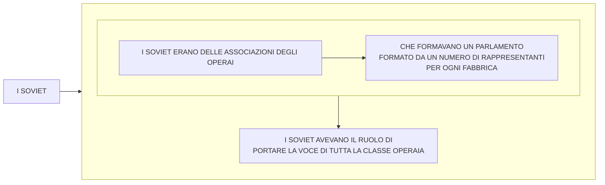
```mermaid
%%{init: { "flowchart": { "wrappingWidth": 400 } }}%%
flowchart LR
  0[I SOVIET]
  subgraph 4[" "]
    subgraph 2[" "]
      direction LR
      1[I SOVIET ERANO DELLE ASSOCIAZIONI DEGLI OPERAI]
      10[CHE FORMAVANO UN PARLAMENTO <br>FORMATO DA UN NUMERO DI RAPPRESENTANTI <br>PER OGNI FABBRICA]
      1 --> 10
    end
    3[I SOVIET AVEVANO IL RUOLO DI <BR> PORTARE LA VOCE DI TUTTA LA CLASSE OPERAIA]
    2 --> 3
  end
  0 --> 4
```

----

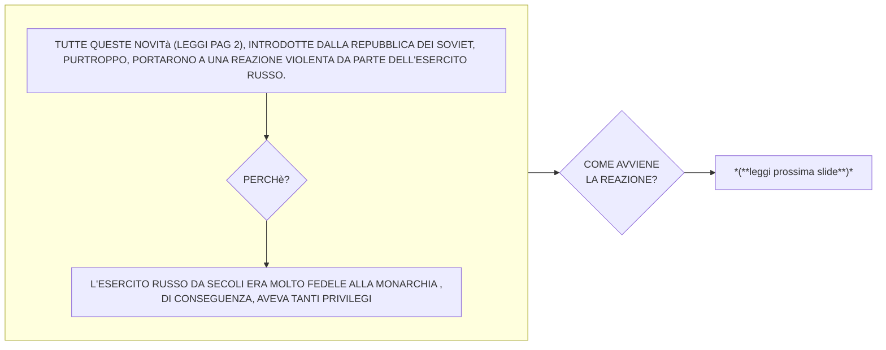
```mermaid
%%{init: { "flowchart": { "wrappingWidth": 700 } }}%%
flowchart LR
  subgraph 3[" "]
    direction TB
    0["TUTTE QUESTE NOVITà (LEGGI PAG 2), INTRODOTTE DALLA REPUBBLICA DEI SOVIET, <br>PURTROPPO, PORTARONO A UNA REAZIONE VIOLENTA DA PARTE DELL'ESERCITO RUSSO."]
    1{PERCHè?}
    2[L'ESERCITO RUSSO DA SECOLI ERA MOLTO FEDELE ALLA MONARCHIA , <br> DI CONSEGUENZA, AVEVA TANTI PRIVILEGI]
    0 --> 1 --> 2
  end
  4{COME AVVIENE <br>LA REAZIONE?}
  3 --> 4
  40["*(**leggi prossima slide**)*"]
  4 --> 40
```

----

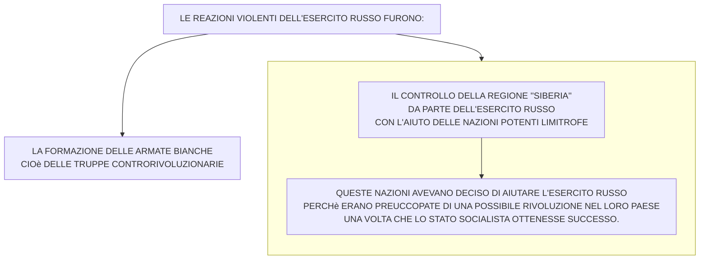
```mermaid
%%{init: { "flowchart": { "wrappingWidth": 700 } }}%%
flowchart TB
  0[LE REAZIONI VIOLENTI DELL'ESERCITO RUSSO FURONO:]
  1[LA FORMAZIONE DELLE ARMATE BIANCHE <br> CIOè DELLE TRUPPE CONTRORIVOLUZIONARIE]
  subgraph 02[" "]
    direction TB
    2[IL CONTROLLO DELLA REGIONE ''SIBERIA'' <BR>DA PARTE DELL'ESERCITO RUSSO <BR>CON L'AIUTO DELLE NAZIONI POTENTI LIMITROFE]
    20[QUESTE NAZIONI AVEVANO DECISO DI AIUTARE L'ESERCITO RUSSO <BR>PERCHè ERANO PREUCCOPATE DI UNA POSSIBILE RIVOLUZIONE NEL LORO PAESE <BR>UNA VOLTA CHE LO STATO SOCIALISTA OTTENESSE SUCCESSO.]
    2 --> 20
  end
  0 --> 1 & 02
```

---

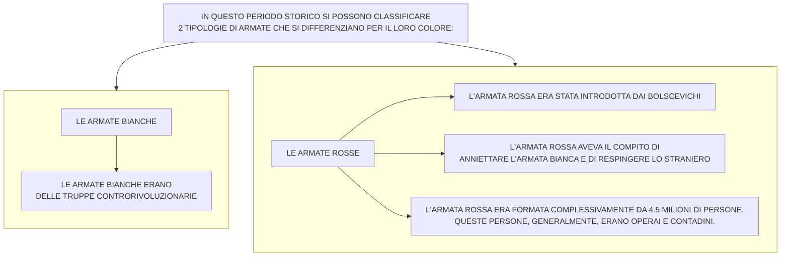
```mermaid
%%{init: { "flowchart": { "wrappingWidth": 700 } }}%%
flowchart TB
  0[IN QUESTO PERIODO STORICO SI POSSONO CLASSIFICARE <br>2 TIPOLOGIE DI ARMATE CHE SI DIFFERENZIANO PER IL LORO COLORE:]
  subgraph 1[" "]
    direction TB;
    10[LE ARMATE BIANCHE]
    100[LE ARMATE BIANCHE ERANO <br>DELLE TRUPPE CONTRORIVOLUZIONARIE]
    10 --> 100
  end
  subgraph 2[" "]
    11[LE ARMATE ROSSE]
    110[L'ARMATA ROSSA ERA STATA INTRODOTTA DAI BOLSCEVICHI]
    111[L'ARMATA ROSSA AVEVA IL COMPITO DI <br>ANNIETTARE L'ARMATA BIANCA E DI RESPINGERE LO STRANIERO]
    112[L'ARMATA ROSSA ERA FORMATA COMPLESSIVAMENTE DA 4.5 MILIONI DI PERSONE. <br> QUESTE PERSONE, GENERALMENTE, ERANO OPERAI E CONTADINI.]
    11 --> 110 & 111 & 112
  end
  0 --> 1 & 2
```

----

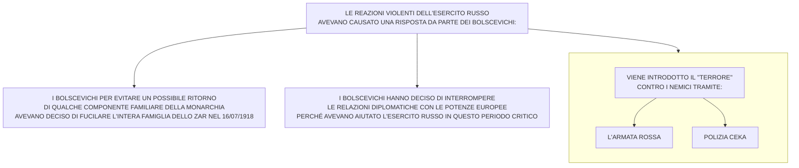
```mermaid
%%{init: { "flowchart": { "wrappingWidth": 800 } }}%%
flowchart TB
  0[LE REAZIONI VIOLENTI DELL'ESERCITO RUSSO <br>AVEVANO CAUSATO UNA RISPOSTA DA PARTE DEI BOLSCEVICHI:]
  1[I BOLSCEVICHI PER EVITARE UN POSSIBILE RITORNO <BR>DI QUALCHE COMPONENTE FAMILIARE DELLA MONARCHIA <BR> AVEVANO DECISO DI FUCILARE L'INTERA FAMIGLIA DELLO ZAR NEL 16/07/1918]
  2[I BOLSCEVICHI HANNO DECISO DI INTERROMPERE <br>LE RELAZIONI DIPLOMATICHE CON LE POTENZE EUROPEE <br> PERCHÉ AVEVANO AIUTATO L'ESERCITO RUSSO IN QUESTO PERIODO CRITICO]
  subgraph 30[" "]
    direction TB
    3[VIENE INTRODOTTO IL ''TERRORE'' <BR> CONTRO I NEMICI TRAMITE:]
    4[L'ARMATA ROSSA]
    5[POLIZIA CEKA]
    3 --> 4 & 5
  end
  0 --> 1 & 2 & 30
```

----

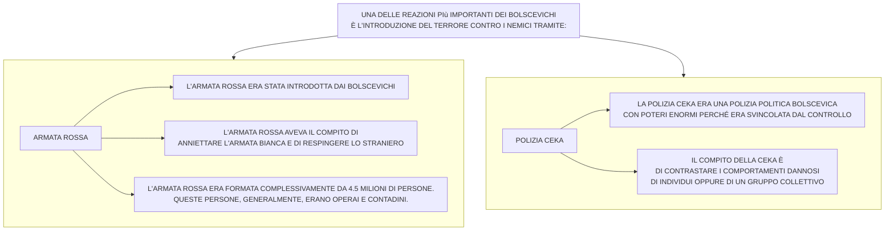
```mermaid
%%{init: { "flowchart": { "wrappingWidth": 800 } }}%%
flowchart TB
  0[UNA DELLE REAZIONI PIù IMPORTANTI DEI BOLSCEVICHI <br> È L'INTRODUZIONE DEL TERRORE CONTRO I NEMICI TRAMITE:]
  subgraph 1[" "]
    10[ARMATA ROSSA]
    11[L'ARMATA ROSSA ERA STATA INTRODOTTA DAI BOLSCEVICHI]
    12[L'ARMATA ROSSA AVEVA IL COMPITO DI <br>ANNIETTARE L'ARMATA BIANCA E DI RESPINGERE LO STRANIERO]
    13[L'ARMATA ROSSA ERA FORMATA COMPLESSIVAMENTE DA 4.5 MILIONI DI PERSONE. <br> QUESTE PERSONE, GENERALMENTE, ERANO OPERAI E CONTADINI.]
    10 --> 11 & 12 & 13
  end
  subgraph 2[" "]
    20 --> 21 & 22
    20[POLIZIA CEKA]
    21[LA POLIZIA CEKA ERA UNA POLIZIA POLITICA BOLSCEVICA <br>CON POTERI ENORMI PERCHÉ ERA SVINCOLATA DAL CONTROLLO]
    22[IL COMPITO DELLA CEKA È <br>DI CONTRASTARE I COMPORTAMENTI DANNOSI <br> DI INDIVIDUI OPPURE DI UN GRUPPO COLLETTIVO]
  end
  0 --> 1 & 2
```

----

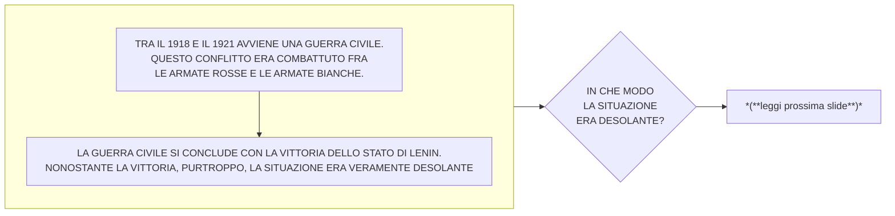
```mermaid
%%{init: { "flowchart": { "wrappingWidth": 800 } }}%%
flowchart LR
  subgraph 3[" "]
    0[TRA IL 1918 E IL 1921 AVVIENE UNA GUERRA CIVILE. <br> QUESTO CONFLITTO ERA COMBATTUTO FRA <br> LE ARMATE ROSSE E LE ARMATE BIANCHE.]
    1[LA GUERRA CIVILE SI CONCLUDE CON LA VITTORIA DELLO STATO DI LENIN. <br>NONOSTANTE LA VITTORIA, PURTROPPO, LA SITUAZIONE ERA VERAMENTE DESOLANTE]
    0 --> 1
  end
  2{IN CHE MODO <br>LA SITUAZIONE <br>ERA DESOLANTE?}
  20["*(**leggi prossima slide**)*"]
  2 --> 20
  3 --> 2
```

----

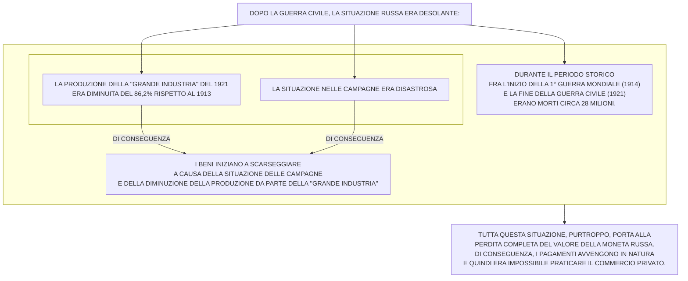
```mermaid
%%{init: { "flowchart": { "wrappingWidth": 800 } }}%%
flowchart TB
  0[DOPO LA GUERRA CIVILE, LA SITUAZIONE RUSSA ERA DESOLANTE:]
  subgraph 6[" "]
    1["DURANTE IL PERIODO STORICO <br> FRA L'INIZIO DELLA 1° GUERRA MONDIALE (1914) <br>E LA FINE DELLA GUERRA CIVILE (1921) <br> ERANO MORTI CIRCA 28 MILIONI."]
    subgraph 4[" "]
      2[LA PRODUZIONE DELLA ''GRANDE INDUSTRIA'' DEL 1921 <br>ERA DIMINUITA DEL 86,2% RISPETTO AL 1913]
      3[LA SITUAZIONE NELLE CAMPAGNE ERA DISASTROSA]
    end
    5[I BENI INIZIANO A SCARSEGGIARE <BR> A CAUSA DELLA SITUAZIONE DELLE CAMPAGNE <BR>E DELLA DIMINUZIONE DELLA PRODUZIONE DA PARTE DELLA ''GRANDE INDUSTRIA'']
  end
  0 --> 1 & 2 & 3
  2 & 3 -->|DI CONSEGUENZA| 5
  7[TUTTA QUESTA SITUAZIONE, PURTROPPO, PORTA ALLA <BR> PERDITA COMPLETA DEL VALORE DELLA MONETA RUSSA. <BR>DI CONSEGUENZA, I PAGAMENTI AVVENGONO IN NATURA <BR> E QUINDI ERA IMPOSSIBILE PRATICARE IL COMMERCIO PRIVATO.]
  6 ---> 7
```

----

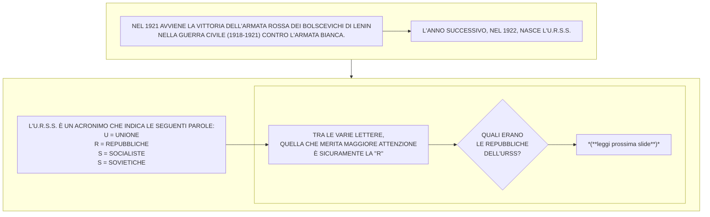
```mermaid
%%{init: { "flowchart": { "wrappingWidth": 800 } }}%%
flowchart TB
  subgraph 1[" "]
    0["NEL 1921 AVVIENE LA VITTORIA DELL'ARMATA ROSSA DEI BOLSCEVICHI DI LENIN <br>NELLA GUERRA CIVILE (1918-1921) CONTRO L'ARMATA BIANCA."]
    01["L'ANNO SUCCESSIVO, NEL 1922, NASCE L'U.R.S.S."]
    0 --> 01
  end
  subgraph 3[" "]
    2[L'U.R.S.S. È UN ACRONIMO CHE INDICA LE SEGUENTI PAROLE: <br> U = UNIONE <br> R = REPUBBLICHE <br> S = SOCIALISTE <br> S = SOVIETICHE]
    subgraph 4[" "]
      20[TRA LE VARIE LETTERE, <br>QUELLA CHE MERITA MAGGIORE ATTENZIONE <br>È SICURAMENTE LA ''R'']
      5{QUALI ERANO<br> LE REPUBBLICHE <br>DELL'URSS?}
      6["*(**leggi prossima slide**)*"]
      20 --> 5 --> 6
    end
    2 --> 20
  end
  1 --> 3
```

----

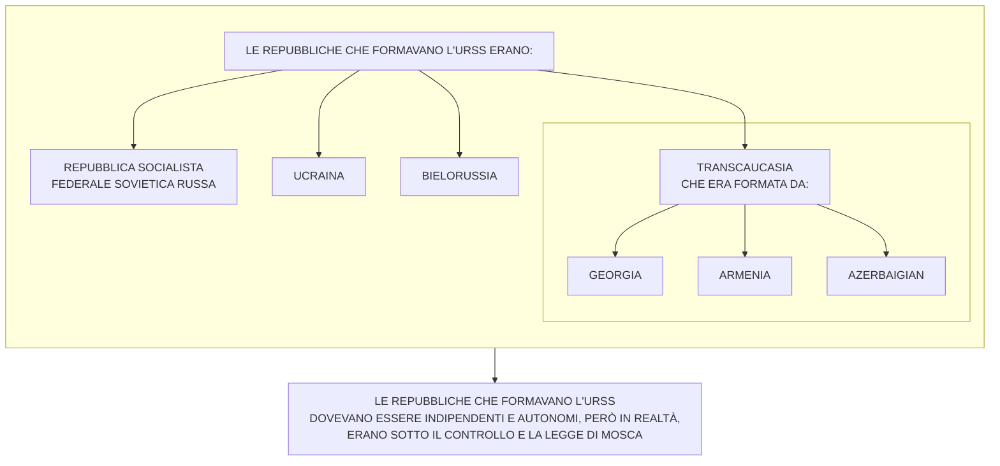
```mermaid
%%{init: { "flowchart": { "wrappingWidth": 800 } }}%%
flowchart TB
  subgraph 1[" "]
    direction TB
    2[LE REPUBBLICHE CHE FORMAVANO L'URSS ERANO:]
    3[REPUBBLICA SOCIALISTA <br> FEDERALE SOVIETICA RUSSA]
    4[UCRAINA]
    5[BIELORUSSIA]
    subgraph 6[" "]
      7[TRANSCAUCASIA <br>CHE ERA FORMATA DA:]
      70[GEORGIA]
      71[ARMENIA]
      72[AZERBAIGIAN]
      7 --> 70 & 71 & 72
    end
    2 --> 3 & 4 & 5 & 7
  end
  0[LE REPUBBLICHE CHE FORMAVANO L'URSS <br>DOVEVANO ESSERE INDIPENDENTI E AUTONOMI, PERÒ IN REALTÀ, <br>ERANO SOTTO IL CONTROLLO E LA LEGGE DI MOSCA]
  1 --> 0
```

---

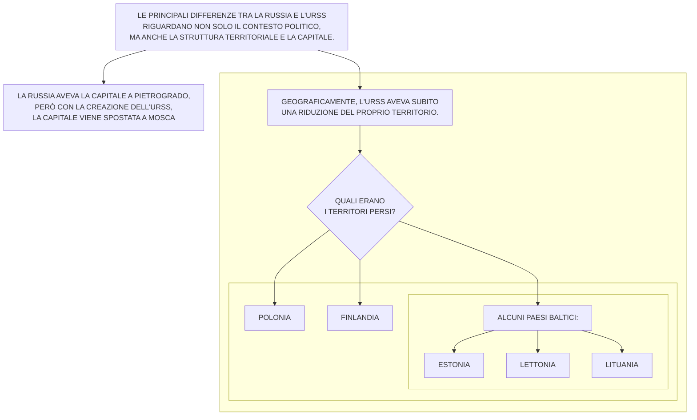
```mermaid
%%{init: { "flowchart": { "wrappingWidth": 800 } }}%%
flowchart TB
  0[LE PRINCIPALI DIFFERENZE TRA LA RUSSIA E L'URSS <br> RIGUARDANO NON SOLO IL CONTESTO POLITICO, <br>MA ANCHE LA STRUTTURA TERRITORIALE E LA CAPITALE.]
  1[LA RUSSIA AVEVA LA CAPITALE A PIETROGRADO, <BR>PERÒ CON LA CREAZIONE DELL'URSS, <BR>LA CAPITALE VIENE SPOSTATA A MOSCA]
  subgraph 3[" "]
    2[GEOGRAFICAMENTE, L'URSS AVEVA SUBITO <BR>UNA RIDUZIONE DEL PROPRIO TERRITORIO.]
    4{QUALI ERANO <br> I TERRITORI PERSI?}
    2 --> 4
    subgraph 5[" "]
      50[POLONIA]
      51[FINLANDIA]
      subgraph 52[" "]
        6[ALCUNI PAESI BALTICI:]
        520[ESTONIA]
        521[LETTONIA]
        522[LITUANIA]
        6 --> 520 & 521 & 522
      end
    end
    4 --> 50 & 51 & 6
  end
  
  0 --> 1 & 2
```

----

MAPPA 20

21 SLIDE CON IMMAGINE BANDIERA

-----

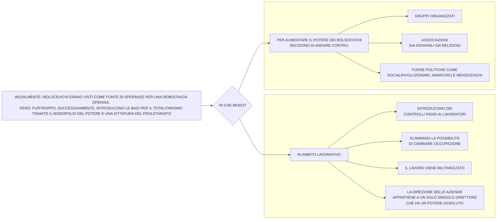
```mermaid
%%{init: { "flowchart": { "wrappingWidth": 800 } }}%%
flowchart LR
  0[INIZIALMENTE I BOLSCEVICHI ERANO VISTI COME FONTE DI SPERANZE PER UNA DEMOCRAZIA OPERAIA, <br>PERÒ, PURTROPPO, SUCCESSIVAMENTE, INTRODUCONO LE BASI PER IL TOTALITARISMO <br>TRAMITE IL MONOPOLIO DEL POTERE E UNA DITTATURA DEL PROLETARIATO]
  1{IN CHE MODO?}
  0 --> 1 --> 20 & 30
  subgraph 2[" "]
    20[PER AUMENTARE IL POTERE DEI BOLSCEVICHI<BR>DECIDONO DI ANDARE CONTRO:]
    21[GRUPPI ORGANIZZATI]
    22[ASSOCIAZIONI <br>SIA GIOVANILI SIA RELIGIOSI]
    23[FORSE POLITICHE COME <br>SOCIALRIVOLUZIONARI, ANARCHICI E MENSCEVICHI]
    20 --> 21 & 22 & 23
  end
  subgraph 3[" "]
    30[IN AMBITO LAVORATIVO:]
    31[INTRODUCONO DEI <BR>CONTROLLI RIGIDI AI LAVORATORI]
    32[ELIMINANO LA POSSIBILITÀ <BR> DI CAMBIARE OCCUPAZIONE]
    33[IL LAVORO VIENE MILITARIZZATO]
    34[LA DIREZIONE DELLE AZIENDE <br> APPARTIENE A UN SOLO SINGOLO DIRETTORE <br> CHE HA UN POTERE ASSOLUTO]
    30 --> 31 & 32 & 33 & 34
  end
```

----

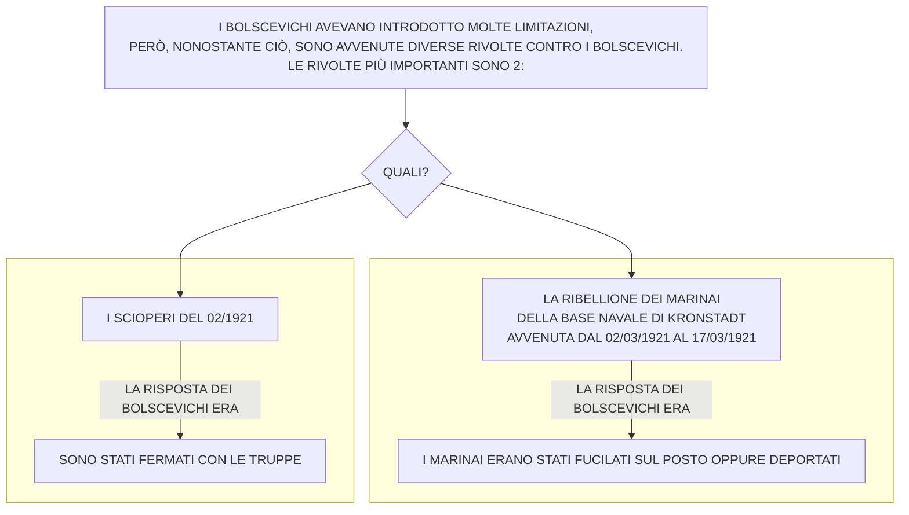
```mermaid
%%{init: { "flowchart": { "wrappingWidth": 800 } }}%%
flowchart TB
  0[I BOLSCEVICHI AVEVANO INTRODOTTO MOLTE LIMITAZIONI, <BR> PERÒ, NONOSTANTE CIÒ, SONO AVVENUTE DIVERSE RIVOLTE CONTRO I BOLSCEVICHI. <BR>LE RIVOLTE PIÙ IMPORTANTI SONO 2:]
  3{QUALI?}
  subgraph 10[" "]
    1[I SCIOPERI DEL 02/1921]
    100[SONO STATI FERMATI CON LE TRUPPE]
    1 -->|LA RISPOSTA DEI BOLSCEVICHI ERA| 100
  end
  subgraph 20[" "]
    2[LA RIBELLIONE DEI MARINAI <br> DELLA BASE NAVALE DI KRONSTADT <br>AVVENUTA DAL 02/03/1921 AL 17/03/1921]
    200[I MARINAI ERANO STATI FUCILATI SUL POSTO OPPURE DEPORTATI]
    2 -->|LA RISPOSTA DEI BOLSCEVICHI ERA| 200
  end
  0 --> 3 --> 1 & 2
```

---

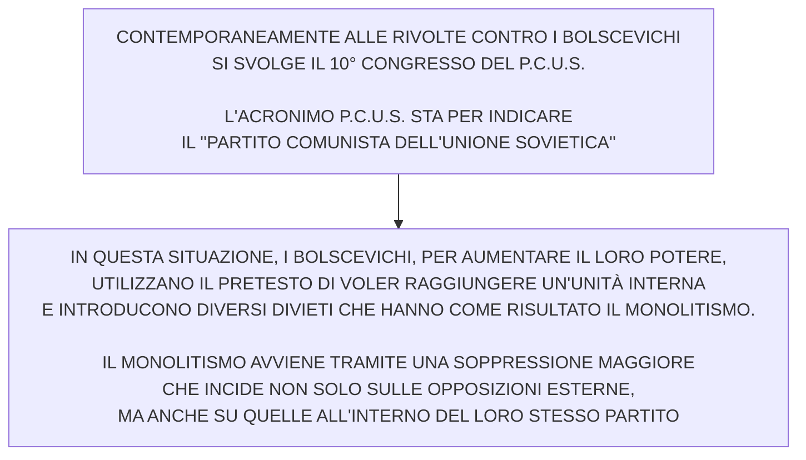
```mermaid
%%{init: { "flowchart": { "wrappingWidth": 800 } }}%%
flowchart TB
  0 --> 1
  0[CONTEMPORANEAMENTE ALLE RIVOLTE CONTRO I BOLSCEVICHI <BR>SI SVOLGE IL 10° CONGRESSO DEL P.C.U.S. <BR><BR>L'ACRONIMO P.C.U.S. STA PER INDICARE <BR>IL ''PARTITO COMUNISTA DELL'UNIONE SOVIETICA'']
  1[IN QUESTA SITUAZIONE, I BOLSCEVICHI, PER AUMENTARE IL LORO POTERE, <br>UTILIZZANO IL PRETESTO DI VOLER RAGGIUNGERE UN'UNITÀ INTERNA <br>E INTRODUCONO DIVERSI DIVIETI CHE HANNO COME RISULTATO IL MONOLITISMO. <br><br>IL MONOLITISMO AVVIENE TRAMITE UNA SOPPRESSIONE MAGGIORE <br>CHE INCIDE NON SOLO SULLE OPPOSIZIONI ESTERNE, <br>MA ANCHE SU QUELLE ALL'INTERNO DEL LORO STESSO PARTITO]
```

---

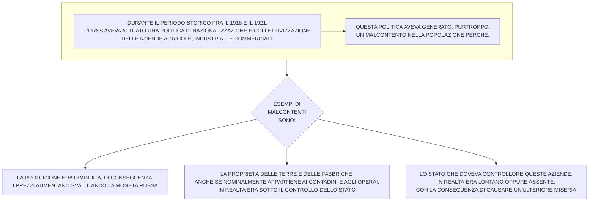
```mermaid
%%{init: { "flowchart": { "wrappingWidth": 800 } }}%%
flowchart TB
  subgraph 3[" "]
    0[DURANTE IL PERIODO STORICO FRA IL 1918 E IL 1921, <br>L'URSS AVEVA ATTUATO UNA POLITICA DI NAZIONALIZZAZIONE E COLLETTIVIZZAZIONE <br>DELLE AZIENDE AGRICOLE, INDUSTRIALI E COMMERCIALI.]
    1[QUESTA POLITICA AVEVA GENERATO, PURTROPPO, <br>UN MALCONTENTO NELLA POPOLAZIONE PERCHÉ:]
  end
  2{ESEMPI DI <BR>MALCONTENTI <BR>SONO:}
  20[LA PRODUZIONE ERA DIMINUITA, DI CONSEGUENZA, <br>I PREZZI AUMENTANO SVALUTANDO LA MONETA RUSSA]
  21[LA PROPRIETÀ DELLE TERRE E DELLE FABBRICHE, <br>ANCHE SE NOMINALMENTE APPARTIENE AI CONTADINI E AGLI OPERAI, <br>IN REALTÀ ERA SOTTO IL CONTROLLO DELLO STATO]
  22[LO STATO CHE DOVEVA CONTROLLORE QUESTE AZIENDE, <br>IN REALTÀ ERA LONTANO OPPURE ASSENTE, <br>CON LA CONSEGUENZA DI CAUSARE UN'ULTERIORE MISERIA]
  0 --> 1 
  3 --> 2
  2 --> 20 & 21 & 22
```

---

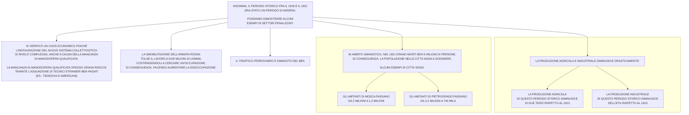
```mermaid
%%{init: { "flowchart": { "wrappingWidth": 800 } }}%%
flowchart TB
  0[INSOMMA, IL PERIODO STORICO FRA IL 1918 E IL 1921 <BR>ERA STATO UN PERIODO DI MISERIA. <BR><BR>POSSIAMO DIMOSTRARE ALCUNI <br> ESEMPI DI SETTORI PENALIZZATI:]
  1["SI VERIFICÒ UN CAOS ECONOMICO POICHÉ <br>L'INSTAURAZIONE DEL NUOVO SISTEMA COLLETTIVISTICO<br> SI RIVELÒ COMPLESSA, ANCHE A CAUSA DELLA MANCANZA<br> DI MANODOPERA QUALIFICATA. <br><br>LA MANCANZA DI MANODOPERA QUALIFICATA SPESSO VENIVA RISOLTA <br>TRAMITE L'ASSUNZIONE DI TECNICI STRANIERI BEN PAGATI <br>(ES.: TEDESCHI E AMERICANI)"]
  2[LA SMOBILITAZIONE DELL'ARMATA ROSSA <br>TOLSE IL LAVORO A DUE MILIONI DI UOMINI, <br>COSTRINGENDOLI A CERCARE UN'OCCUPAZIONE, <br> DI CONSEGUENZA, FACENDO AUMENTARE LA DISOCCUPAZIONE.]

  subgraph 6[" "]
    3[IN AMBITO UMANISTICO, NEL 1921 ERANO MORTI BEN 5 MILIONI DI PERSONE, <br>DI CONSEGUENZA, LA POPOLAZIONE NELLE CITTÀ INIZIA A SCENDERE. <br><br>ALCUNI ESEMPI DI CITTÀ SONO:]
    60[GLI ABITANTI DI MOSCA       PASSANO <br>DA 2 MILIONI   A 1,2 MILIONI]
    61[GLI ABITANTI DI PIETROGRADO PASSANO <BR>DA 2,2 MILIONI A 740 MILA]
    3 --> 60 & 61
  end
  subgraph 7[" "]
    4[LA PRODUZIONE AGRICOLA E INDUSTRIALE DIMINUISCE DRASTICAMENTE:]
    70[LA PRODUZIONE AGRICOLA    <br>DI QUESTO PERIODO STORICO DIMINUISCE <br> DI DUE TERZI RISPETTO AL 1913]
    71[LA PRODUZIONE INDUSTRIALE <br>DI QUESTO PERIODO STORICO DIMINUISCE <br> DELL'87% RISPETTO AL 1913]
    4 --> 70 & 71
  end
  5[IL TRAFFICO FERROVIARIO È DIMINUITO DEL 88%]
  0 --> 1 & 2 & 3 & 4 & 5
```

----

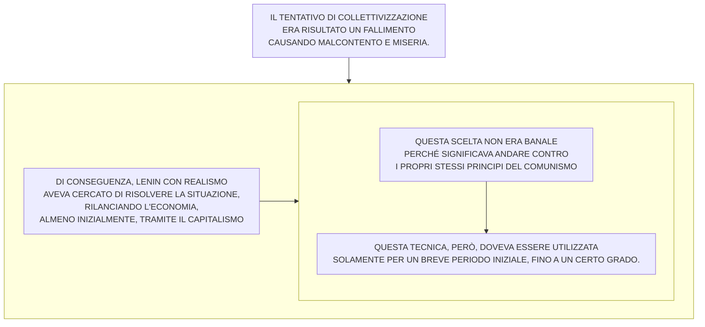
```mermaid
%%{init: { "flowchart": { "wrappingWidth": 800 } }}%%
flowchart TB
  0[IL TENTATIVO DI COLLETTIVIZZAZIONE <br>ERA RISULTATO UN FALLIMENTO<br> CAUSANDO MALCONTENTO E MISERIA.]
  subgraph 10[" "]
    1[DI CONSEGUENZA, LENIN CON REALISMO <br>AVEVA CERCATO DI RISOLVERE LA SITUAZIONE, <br>RILANCIANDO L'ECONOMIA, <br>ALMENO INIZIALMENTE, TRAMITE IL CAPITALISMO]
    subgraph 2[" "]
      direction TB
      3[QUESTA SCELTA NON ERA BANALE <br>PERCHÉ SIGNIFICAVA ANDARE CONTRO <br>I PROPRI STESSI PRINCIPI DEL COMUNISMO]
      30[QUESTA TECNICA, PERÒ, DOVEVA ESSERE UTILIZZATA <br>SOLAMENTE PER UN BREVE PERIODO INIZIALE, FINO A UN CERTO GRADO.]
      3 --> 30
    end
    1 --> 2
  end
  0 --> 10
```

---

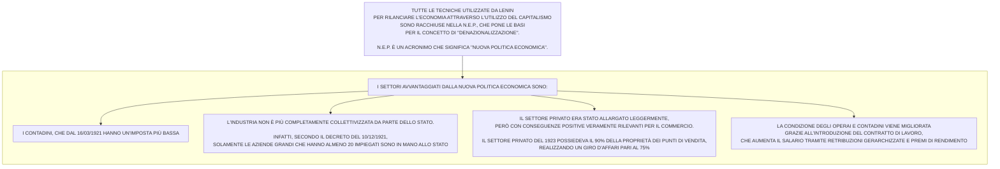
```mermaid
%%{init: { "flowchart": { "wrappingWidth": 800 } }}%%
flowchart TB
  0[TUTTE LE TECNICHE UTILIZZATE DA LENIN <BR>PER RILANCIARE L'ECONOMIA ATTRAVERSO L'UTILIZZO DEL CAPITALISMO <BR> SONO RACCHIUSE NELLA N.E.P., CHE PONE LE BASI <BR>PER IL CONCETTO DI ''DENAZIONALIZZAZIONE''. <BR><BR>N.E.P. È UN ACRONIMO CHE SIGNIFICA ''NUOVA POLITICA ECONOMICA''.]
  subgraph 2[" "]
    1[I SETTORI AVVANTAGGIATI DALLA NUOVA POLITICA ECONOMICA SONO:]
    10[I CONTADINI, CHE DAL 16/03/1921 HANNO UN'IMPOSTA PIÙ BASSA]
    11[L'INDUSTRIA NON È PIÙ COMPLETAMENTE COLLETTIVIZZATA DA PARTE DELLO STATO. <br><br>INFATTI, SECONDO IL DECRETO DEL 10/12/1921, <br>SOLAMENTE LE AZIENDE GRANDI CHE HANNO ALMENO 20 IMPIEGATI SONO IN MANO ALLO STATO]
    12[IL SETTORE PRIVATO ERA STATO ALLARGATO LEGGERMENTE, <br>PERÒ CON CONSEGUENZE POSITIVE VERAMENTE RILEVANTI PER IL COMMERCIO. <br><br>IL SETTORE PRIVATO DEL 1923 POSSIEDEVA IL 90% DELLA PROPRIETÀ DEI PUNTI DI VENDITA, <br>REALIZZANDO UN GIRO D'AFFARI PARI AL 75%]
    13[LA CONDIZIONE DEGLI OPERAI E CONTADINI VIENE MIGLIORATA <br>GRAZIE ALL'INTRODUZIONE DEL CONTRATTO DI LAVORO, <br>CHE AUMENTA IL SALARIO TRAMITE RETRIBUZIONI GERARCHIZZATE E PREMI DI RENDIMENTO]
  end
  0 --> 1 --> 10 & 11 & 12 & 13
```